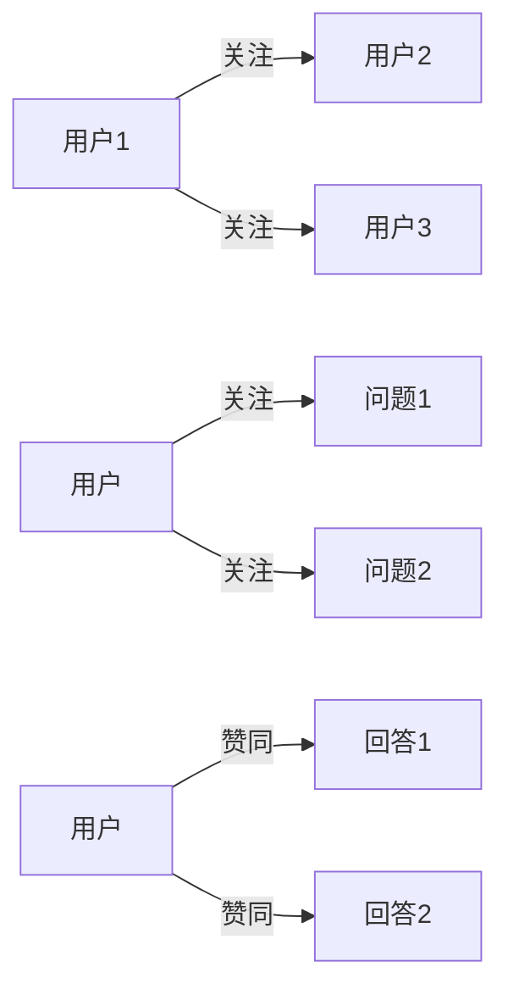
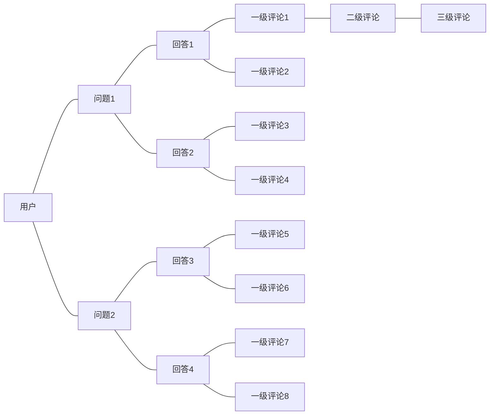
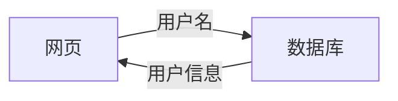
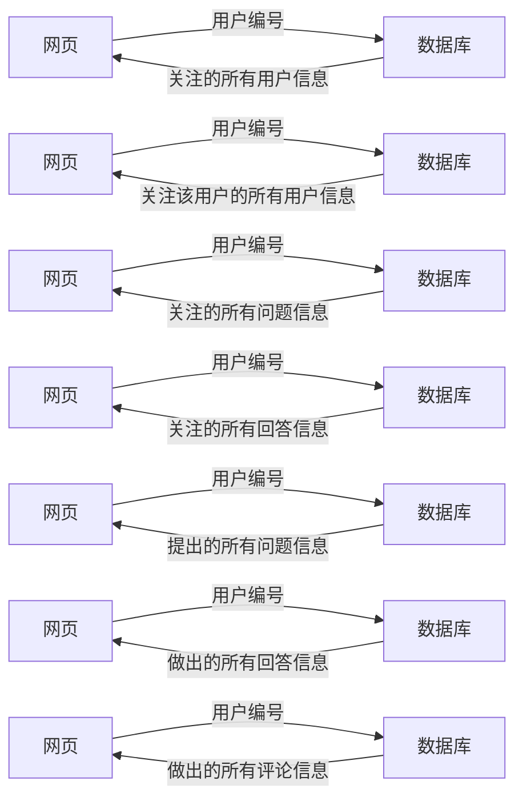

| user                 | 用户表                   |
| -------------------- | ------------------------ |
| user_id              | 用户编号                 |
| user_name            | 用户名                   |
| user_nickname        | 用户昵称                 |
| user_avatar          | 用户头像                 |
| user_sex             | 用户性别                 |
| user_email           | 用户邮箱                 |
| user_password        | 用户密码                 |
| user_register_time   | 用户注册时间             |
| user_last_login_time | 用户最近一次登录的时间   |
| user_last_login_ip   | 用户最近一次登录的IP地址 |
| user_status          | 用户状态                 |

| user_relation_user | 用户与用户关系表 | 外键          |
| ------------------ | ---------------- | ------------- |
| from_user_id       | 发起用户编号     | user表user_id |
| to_user_id         | 关注用户编号     | user表user_id |

| user_relation_question | 用户与问题关系表 | 外键                  |
| ---------------------- | ---------------- | --------------------- |
| from_user_id           | 发起用户编号     | user表user_id         |
| to_question_id         | 关注问题编号     | question表question_id |

| user_relation_answer | 用户与回答关系表 | 外键              |
| -------------------- | ---------------- | ----------------- |
| from_user_id         | 发起用户编号     | user表user_id     |
| to_answer_id         | 赞同回答编号     | answer表answer_id |

| question              | 问题表                             | 外键          |
| --------------------- | ---------------------------------- | ------------- |
| question_id           | 问题编号                           |               |
| question_user_id      | 问题的提问者用户编号（关联用户表） | user表user_id |
| question_title        | 问题标题                           |               |
| question_content      | 问题内容                           |               |
| question_view_count   | 问题浏览量                         |               |
| question_follow_count | 问题关注量                         |               |
| question_answer_count | 问题回答量                         |               |
| question_update_time  | 问题更新时间                       |               |
| question_create_time  | 问题创建时间                       |               |
| question_status       | 问题状态                           |               |

| answer             | 回答表                             | 外键                  |
| ------------------ | ---------------------------------- | --------------------- |
| answer_id          | 回答编号                           |                       |
| answer_user_id     | 回答的回答者用户编号（关联用户表） | user表user_id         |
| answer_question_id | 回答所对应的问题编号（关联问题表） | question表question_id |
| answer_content     | 回答内容                           |                       |
| answer_view_count  | 回答浏览量                         |                       |
| answer_agree_count | 回答赞同量                         |                       |
| answer_update_time | 回答更新时间                       |                       |
| answer_create_time | 回答创建时间                       |                       |
| answer_status      | 回答状态                           |                       |

| comment           | 评论表                             | 外键/备注                                                  |
| ----------------- | ---------------------------------- | ---------------------------------------------------------- |
| comment_id        | 评论编号                           |                                                            |
| comment_user_id   | 评论的评论者用户编号（关联用户表） | user表user_id                                              |
| comment_answer_id | 评论所对应的回答编号（关联回答表） | answer表answer_id                                          |
| comment_last_id   | 评论上一条评论编号（关联评论表）   | 为Null表示一级评论，否则为二级及以上评论（评论评论的评论） |
| comment_content   | 评论内容                           |                                                            |
| comment_time      | 评论时间                           |                                                            |

由于外键约束

1、当删除用户时，用户关注用户表、用户关注问题表、用户赞同回答表的该用户关系均会删除，问题表、回答表、评论表也会删除该用户的问题、回答及评论；

2、当删除问题时，用户关注问题表的用户关系会删除，问题表、回答表也会删除问题及回答；

3、当删除回答时，用户赞同回答表的用户关系会删除，回答表、评论表也会删除回答及评论。

但是删除评论时，评标表之间无法用外键约束，故该逻辑关系在服务层操作：当删除某一评论时，删除该评论所有下级评论

操作方式：在评论表Comment中,comment_last_id指评论的上一条评论编号，为NULL表示为一级评论，反之为二级及以上评论

删除某一评论时，先删除数据库中comment_last_id值为当前评论comment_id的评论

### 登录页面

数据库根据用户名查找用户信息，如果存在，返回实际用户信息，如果不存在，返回用户信息为空

### 用户个人页面

