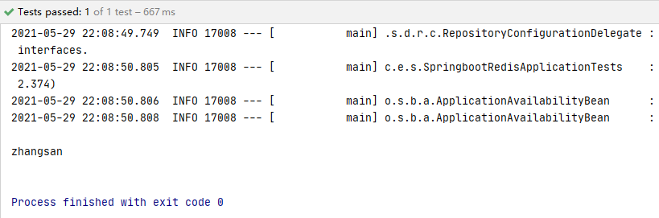

# Redis

## 一、概述

### 1、什么是Redis

Redis（Remote Dictionary Server )，即远程字典服务，是一个开源的使用ANSI [C语言](https://baike.baidu.com/item/C语言)编写、支持网络、可基于内存亦可持久化的日志型、Key-Value[数据库](https://baike.baidu.com/item/数据库/103728)，并提供多种语言的API

### 2、Redis常见应用场景

- 内存存储、持久化
- 效率高，可用于高速存储
- 发布订阅系统
- 地图信息分析
- 计时器、计数器(浏览量)

### 3、支持语言

| **ActionScript** | **Common Lisp** | **Haxe**    | **Objective-C** | **R**         |
| ---------------- | --------------- | ----------- | --------------- | ------------- |
| **C**            | **Dart**        | **Io**      | **Perl**        | **Ruby**      |
| **C++**          | **Eriang**      | **Java**    | **PHP**         | **Scala**     |
| **C#**           | **Go**          | **Node.js** | **Pure Data**   | **Smalltalk** |
| **Clojure**      | **Haskell**     | **Lua**     | **Python**      | **Tcl**       |

### 4、特性

- 多样的数据类型
- 持久化
- 集群
- 事务

## 二、Redis安装

**官网：**[Redis官网](https://redis.io/)

**中文网站：**[Redis中文网](http://www.redis.cn/)

**Windows版本下载地址：**[Windows版本](https://github.com/MicrosoftArchive/redis/releases)

**Linux版本下载地址：**[Linux版本](https://redis.io/download)

### 1、Windows下安装

下载安装包并解压至指定目录 E:/Environment/Redis-x64-3.2.100

打开cmd命令窗口，安装与注册redis到Windows服务

安装命令：redis-server.exe --service-install redis.windows.conf --loglevel verbose

启动服务命令：redis-server.exe --service-start

关闭服务命令：redis-server.exe --service-stop

```bash
C:\Users\42930>E:

E:\>cd E:/Environment/Redis-x64-3.2.100

#我之前已经成功安装注册redis，所以此处报错
E:\Environment\Redis-x64-3.2.100>redis-server.exe --service-install redis.windows.conf --loglevel verbose
[2916] 28 May 20:22:31.846 # HandleServiceCommands: system error caught. error code=1073, message = CreateService failed: unknown error

E:\Environment\Redis-x64-3.2.100>redis-server.exe --service-start
[15164] 28 May 20:23:50.780 # Redis service successfully started.

E:\Environment\Redis-x64-3.2.100>redis-server.exe --service-stop
[5348] 28 May 20:25:53.436 # Redis service successfully stopped.
```

在redis服务启动的前提下

打开安装目录下的redis-cli.exe文件 即可开始运行

```bash
127.0.0.1:6379> ping
PONG
```

### 2、Linux下安装

略

## 三、五大基本数据类型

### **1、String类型(字符串)**

单个key的常见操作

```bash
127.0.0.1:6379> keys * 			#查看所有key
(empty list or set)
127.0.0.1:6379> SET name test		#设置key-value(key：name,value：test)
OK
127.0.0.1:6379> GET name 			#获得key的值("test")
"test"
127.0.0.1:6379> APPEND name ",this is a test" #追加字符串，如果当前key不存在，则相当于设置key-value
19
127.0.0.1:6379> GET name
"test,this is a test"
127.0.0.1:6379> EXISTS name 		#判断某一个key是否存在(此处为name)
(integer) 1
127.0.0.1:6379127.0.0.1:6379> STRLEN name   	#获得某一个key值的字符串长度(此处为name)
(integer) 19
127.0.0.1:6379> EXPIRE name 10  	#设置某一个key的过期时间(此处key为name) 单位为秒(此处为10秒)
(integer) 1
127.0.0.1:6379> TTL name			#查看某一个key的剩余时间(此处为name)
(integer) 8
127.0.0.1:6379> TTL name
(integer) 6
127.0.0.1:6379> TTL name
(integer) 2
127.0.0.1:6379> TTL name
(integer) 1
127.0.0.1:6379> TTL name
(integer) -2
127.0.0.1:6379> TTL name
(integer) -2
##################################################
127.0.0.1:6379> SET views 0 #设置views值为0
OK
127.0.0.1:6379> GET views
"0"
127.0.0.1:6379> ICNR views  #自增1
(integer) 1
127.0.0.1:6379> DECR views  #自减1
(integer) 0
127.0.0.1:6379> INCRBY views 10 #自增10
(integer) 10
127.0.0.1:6379> DECRBY views 10 #自减10
(integer) 0
##################################################
127.0.0.1:6379> SET key1 "hello,world" 	#设置key1的值
OK
127.0.0.1:6379> GET key1
"hello,world"
127.0.0.1:6379> GETRANGE key1 0 3    		#截取字符串[0,3]
"hell"
127.0.0.1:6379> GETRANGE key1 0 -1	  	#获取全部字符串
"hello,world"
##################################################
127.0.0.1:6379> SET key2 abcdefg			#设置key2的值
OK
127.0.0.1:6379> GET key2
"abcdefg"
127.0.0.1:6379> SETRANGE key2 1 xxx 		#替换指定位置开始的字符串(此处从位置1开始替换"xxx")
7
127.0.0.1:6379> GET key2
"axxxefg"
##################################################
# SETEX (set with expire)  		#设置过期时间
# SETNX (set if not exist) 		#不存在则设置(在分布式锁中常常使用)
127.0.0.1:6379> SETEX key3 20 "This is key3"		#设置key3的值为"This is key3",并在20秒后过期
OK
127.0.0.1:6379> TTL key3			#查看key3的剩余时间
(integer) 13
127.0.0.1:6379> TTL key3
(integer) -2
127.0.0.1:6379> GET key3
(nil)
127.0.0.1:6379> SETNX mykey "redis"		#不存在mykey则设置mykey为"redis"
(integer) 1
127.0.0.1:6379> keys *					#查看所有key
1) "mykey"
127.0.0.1:6379> SETNX mykey "MongoDB"		#不存在mykey则设置mykey为"MongoDB"(此处mykey存在，则设置失败)
(integer) 0
127.0.0.1:6379> GET mykey					#获得mykey的值
"redis"						#mykey的值仍然为"redis",没有被覆盖为“MongoDB"
```

多个key批量设置

```bash
127.0.0.1:6379> MSET k1 v1 k2 v2 k3 v3	#同时设置多个值
OK
127.0.0.1:6379> keys *
1) "k1"
2) "k2"
3) "k3"
127.0.0.1:6379> MGET k1 k2 k3				#同时获取多个值
1) "v1"
2) "v2"
3) "v3"
127.0.0.1:6379> MSETNX k1 v1 k4 v4		#MSETNX是一个原子性的操作，要么一起成功，要么一起失败
(integer) 0
127.0.0.1:6379> GET k4
(nil)
##################################################
127.0.0.1:6379> MSET user:1:name zhangsan user:1:age 18	#此处key的格式 user:{id}:{filed}
OK
127.0.0.1:6379> MSET user:1:name user:1:age
1) "zhangsan"
2) "18"
```

组合设置

```bash
GETSET #先GET再SET
127.0.0.1:6379> GETSET db redis		#如果不存在值则返回nil
(nil)
127.0.0.1:6379> GET db
"redis"
127.0.0.1:6379> GETSET db mongodb		#如果存在值，获取原来的值并设置新的值
"redis"
127.0.0.1:6379> GET db
"mongodb"
```

String类似的使用场景：value除了是字符串还可以是数字

- 计数器
- 统计多单位的数量
- 对象缓存存储

### **2、List类型(列表)**

> LPUSH：在list头部插入值

> RPUSH：在list尾部插入值

```bash
127.0.0.1:6379> LPUSH list one		#将一个或多个值插入到list的头部(左)
(integer) 1
127.0.0.1:6379> LPUSH list two
(integer) 2
127.0.0.1:6379> LPUSH list three
(integer) 3
127.0.0.1:6379> LRANGE list 0 -1		#获得list的值
1) "three"
2) "two"
3) "one"
127.0.0.1:6379> LRANGE list 1 2		#通过区间获取具体的值(此处区间为1-2)
1) "two"
2) "one"
127.0.0.1:6379> RPUSH list right		#将一个或多个值插入到list的尾部(右)
(integer) 4
127.0.0.1:6379> LRANGE list 0 -1
1) "three"
2) "two"
3) "one"
4) "right"
```

> LPOP：移除list第一个元素

> RPOP：移除list最后一个元素

```bash
127.0.0.1:6379> LRANGE list 0 -1
1) "three"
2) "two"
3) "one"
4) "right"
127.0.0.1:6379> LPOP list				#移除list的第一个元素
"three"
127.0.0.1:6379> LRANGE list 0 -1
1) "two"
2) "one"
3) "right"
127.0.0.1:6379> RPOP list				#移除list的最后一个元素
"right"
127.0.0.1:6379> LRANGE list 0 -1
1) "two"
2) "one"
```

> LINDEX：通过下标获取list中的某一个值

```bash
127.0.0.1:6379> LRANGE list 0 -1
1) "two"
2) "one"
127.0.0.1:6379> LINDEX list 0			#通过下标获取list中的第0个值
"two"
127.0.0.1:6379> LINDEX list 1
"one"
```

> LLEN：获得list的长度

```bash
127.0.0.1:6379> LPUSH list one
(integer) 1
127.0.0.1:6379> LPUSH list two
(integer) 2
127.0.0.1:6379> LPUSH list three
(integer) 3
127.0.0.1:6379> LRANGE list 0 -1
1) "three"
2) "two"
3) "one"
127.0.0.1:6379> LLEN list			#获得list长度
(integer) 3
```

> LREM：移除list中指定个数的值

```bash
127.0.0.1:6379> LRANGE list 0 -1
1) "three"
2) "three"
3) "two"
4) "one"
127.0.0.1:6379> LREM list 1 one		#移除list中1个"one"
(integer) 1
127.0.0.1:6379> LRANGE list 0 -1
1) "three"
2) "three"
3) "two"
127.0.0.1:6379> LREM list 1 three
(integer) 1
127.0.0.1:6379> LRANGE list 0 -1
1) "three"
2) "two"
127.0.0.1:6379> LPUSH list three
(integer) 3
127.0.0.1:6379> LRANGE list 0 -1
1) "three"
2) "three"
3) "two"
127.0.0.1:6379> LREM list 2 three
(integer) 2
127.0.0.1:6379> LRANGE list 0 -1
1) "two"
```

> LTRIM：截取指定长度

```bash
127.0.0.1:6379> RPUSH mylist "hello"
(integer) 1
127.0.0.1:6379> RPUSH mylist "hello1"
(integer) 2
127.0.0.1:6379> RPUSH mylist "hello2"
(integer) 3
127.0.0.1:6379> RPUSH mylist "hello3"
(integer) 4
127.0.0.1:6379> LRANGE mylist 0 -1
1) "hello"
2) "hello1"
3) "hello2"
4) "hello3"
127.0.0.1:6379> LTRIM mylist 1 2			#通过下标截取1-2号元素，mylist只剩下被截取的元素
OK
127.0.0.1:6379> LRANGE mylist 0 -1
1) "hello1"
2) "hello2"
```

> RPOPLPUSH：移除原list最后一个元素并添加至新的list中

```bash
127.0.0.1:6379> RPUSH list "hello1"
(integer) 1
127.0.0.1:6379> RPUSH list "hello2"
(integer) 2
127.0.0.1:6379> RPUSH list "hello3"
(integer) 3
127.0.0.1:6379> LRANGE list 0 -1
1) "hello1"
2) "hello2"
3) "hello3"
127.0.0.1:6379> RPOPLPUSH list mylist		#移除list最后一个元素并添加至mylist中
"hello3"
127.0.0.1:6379> LRANGE list 0 -1			#查看list
1) "hello1"
2) "hello2"
127.0.0.1:6379> LRANGE mylist 0 -1		#查看mylist
1) "hello3"
```

> LSET：将list中指定下标的值替换为另一个值（更新操作)

```bash
127.0.0.1:6379> EXISTS list				#判断list列表是否存在
(integer) 0
127.0.0.1:6379> LSET list 0 item			#若list不存在则更新报错
(error) ERR no such key
127.0.0.1:6379> LPUSH list value1
(integer) 1
127.0.0.1:6379> LRANGE list 0 0
1) "value1"
127.0.0.1:6379> LSET list 0 item			#若list存在则更新下标的值
OK
127.0.0.1:6379> LRANGE list 0 0
1) "item"
127.0.0.1:6379> LSET list 1 other			#若该下标值不存在则更新报错
(error) ERR index out of range
```

> LINSERT：在list中某个元素之前或之后插入一个值

```bash
127.0.0.1:6379> RPUSH mylist "hello"
(integer) 1
127.0.0.1:6379> RPUSH mylist "world"
(integer) 2
127.0.0.1:6379> LRANGE mylist 0 -1
1) "hello"
2) "world"
127.0.0.1:6379> LINSERT mylist before "world" "other"		#在mylist中"world"元素之插入一个值"other"
3
127.0.0.1:6379> LRANGE mylist 0 -1
1) "hello"
2) "other"
3) "world"
127.0.0.1:6379> LINSERT mylist after "world" "new"
4
127.0.0.1:6379> LRANGE mylist 0 -1
1) "hello"
2) "other"
3) "world"
4) "new"
```

- list实际上是一个链表 before Node after,left,right都可以插入值
- 如果key不存在，则创建新的链表
- 如果key存在，则新增内容
- 如果移除了所有值，空链表也代表不存在
- 在两边插入或者改动值，效率最高
- 消息队列(LPUSH RPOP)，栈(LPUSH LPOP)

### **3、Set类型(集合)**

set中的值是不能重复的

> SADD：向set中添加元素
>
> SMEMBERS：查看指定set中所有值

```bash
127.0.0.1:6379> SADD myset "hello1"		#向myset中添加元素"hello1"
(integer) 1
127.0.0.1:6379> SADD myset "hello2"
(integer) 1
127.0.0.1:6379> SADD myset "hello3"
(integer) 1
127.0.0.1:6379> SMEMBERS myset			#查看myset的所有值
1) "hello3"
2) "hello2"
3) "hello1"
```

> SISMEMBER：判断set中是否存在某个值
>
> SCARD：获得set中元素个数
>
> SREM：移除set中指定元素

```bash
127.0.0.1:6379> SMEMBERS myset			#查看myset的所有值
1) "hello3"
2) "hello2"
3) "hello1"
127.0.0.1:6379> SISMEMBER myset "hello1"	#判断myset中是否存在某个值
(integer) 1					#存在
127.0.0.1:6379> SISMEMBER myset "hello"
(integer) 0					#不存在
##################################################
127.0.0.1:6379> SCARD myset				#获得myset中元素个数
3
##################################################
127.0.0.1:6379> SREM myset "hello1"		#移除myset中"hello1"
1
127.0.0.1:6379> SMEMBERS myset
1) "hello3"
2) "hello2"
```

> SRANDMEMBER：随机获取set中某个(或指定个数)元素

```bash
127.0.0.1:6379> SMEMBERS myset
1) "hello1"
2) "hello3"
3) "hello2"
127.0.0.1:6379> SRANDMEMBER myset		#随机获取myset中某个元素
"hello1"
127.0.0.1:6379> SRANDMEMBER myset
"hello2"
127.0.0.1:6379> SRANDMEMBER myset
"hello2"
127.0.0.1:6379> SRANDMEMBER myset 2	#随机获取myset中指定个数的元素(此处为随机获取myset集合中的2个元素)
1) "hello2"
2) "hello1"
127.0.0.1:6379> SRANDMEMBER myset 2
1) "hello3"
2) "hello1"
```

> SPOP：随机移除指定 set的一个元素

```bash
127.0.0.1:6379> SMEMBERS myset
1) "hello1"
2) "hello3"
3) "hello2"
127.0.0.1:6379> SPOP myset	#随机移除myset中的一个值
"hello2"
127.0.0.1:6379> SPOP myset
"hello1"
127.0.0.1:6379> SMEMBERS myset
1) "hello3"
```

> SMOVE：移除原set某个元素至新set中

```bash
127.0.0.1:6379> SADD myset1 "hello1"
(integer) 1
127.0.0.1:6379> SADD myset1 "hello2"
(integer) 1
127.0.0.1:6379> SADD myset1 "hello3"
(integer) 1
127.0.0.1:6379> SADD myset2 "world1"
(integer) 1
127.0.0.1:6379> SMEMBERS myset1
1) "hello3"
2) "hello2"
3) "hello1"
127.0.0.1:6379> SMEMBERS myset2
1) "world1"
127.0.0.1:6379> SMOVE myset1 myset2 "hello2"	#移除myset1中"hello2"至myset2中
(integer) 1
127.0.0.1:6379> SMEMBERS myset1
1) "hello3"
2) "hello1"
127.0.0.1:6379> SMEMBERS myset2
1) "hello2"
2) "world1"
```

> SDIFF：差集
>
> SINTER：交集
>
> SUNION：并集

```bash
127.0.0.1:6379> SMEMBERS key1
1) "c"
2) "a"
3) "b"
127.0.0.1:6379> SMEMBERS key2
1) "d"
2) "c"
3) "e"
127.0.0.1:6379> SDIFF key1 key2	#key1与key2的差集
1) "a"
2) "b"
127.0.0.1:6379> SINTER key1 key2	#key1与key2的交集
1) "c"
127.0.0.1:6379> SUNION key1 key2	#key1与key2的并集
1) "a"
2) "c"
3) "b"
4) "d"
5) "e"
```

利用set可以实现共同关注、好友推荐等

### **4、ZSet集合(有序集合)**

在set集合的基础上增加了一个值 set k1 v1	zset k1 score1 v1

> ZADD：向zest集合添加一个或多个值
>
> ZRANGE：获得指定区间的值

```bash
127.0.0.1:6379> ZADD myset 1 one				#myset添加1个值
(integer) 1
127.0.0.1:6379> ZADD myset 2 two 3 three		#myset添加2个值
(integer) 2
127.0.0.1:6379> ZRANGE myset 0 -1				#获得myset所有值
1) "one"
2) "two"
3) "three"
127.0.0.1:6379> ZRANGE myset 0 -1 withscores	#获得myset所有值并带上数据
1) "one"
2) 1.0
3) "two"
4) 2.0
5) "three"
6) 3.0
```

ZRANGEBYSCORE：按升序显示元素

ZREVRANGE：按降序显示元素

```bash
127.0.0.1:6379> ZADD salary 500 zhangsan
(integer) 1
127.0.0.1:6379> ZADD salary 400 lisi
(integer) 1
127.0.0.1:6379> ZADD salary 600 wanger
(integer) 1
127.0.0.1:6379> ZRANGEBYSCORE salary -inf +inf				#显示全部元素(升序排列)
1) "lisi"
2) "zhangsan"
3) "wanger"
127.0.0.1:6379> ZREVRANGE salary 0 -1							#显示全部元素(降序排列)
1) "wanger"
2) "zhangsan"
3) "lisi"
127.0.0.1:6379> ZRANGEBYSCORE salary -inf +inf withscores		#显示全部元素并带上数据(升序排列)
1) "lisi"
2) 400.0
3) "zhangsan"
4) 500.0
5) "wanger"
6) 600.0
127.0.0.1:6379> ZRANGEBYSCORE salary -inf 500 withscores		#显示低于500的所有元素并带上数据升序排列
1) "lisi"
2) 400.0
3) "zhangsan"
4) 500.0
```

> ZREM：移除zset中的特定元素
>
> ZCARD：获得zset中的元素个数

```bash
127.0.0.1:6379> ZRANGE salary 0 -1
1) "lisi"
2) "zhangsan"
3) "wanger"
127.0.0.1:6379> ZREM salary lisi		#移除salary中的"lisi"元素
1
127.0.0.1:6379> ZRANGE salary 0 -1
1) "zhangsan"
2) "wanger"
127.0.0.1:6379> ZCARD salary			#获得salary中的元素个数
2
```

> ZCOUNT：获得指定区间内元素数量

```bash
127.0.0.1:6379> ZRANGE myset 0 -1 withscores
1) "one"
2) 1.0
3) "two"
4) 2.0
5) "three"
6) 3.0
127.0.0.1:6379> ZCOUNT myset 1 3		#获得1-3区间内元素数量
3
127.0.0.1:6379> ZCOUNT myset 1 2		#获得1-2区间内元素数量
2
```

- set排序：班级成绩表、工资表
- 带权消息排序

### **5、Hash(哈希)**

> HSET：设置一个具体的key-value
>
> HGET：获得一个字段值
>
> HMSET：设置多个字段值(HMSET从redis4.0版本后已被官方弃用，建议使用HSET)
>
> HMGET：获得多个字段值
>
> HGETALL：获得所有字段值
>
> HDEL：删除hash指定字段，对应value值也会消失

```bash
127.0.0.1:6379> HSET myhash user1 zhangsan			#设置myhash key:user1 value:zhangsan
1
127.0.0.1:6379> HGET myhash user1						#获得user1字段值
"zhangsan"
127.0.0.1:6379> HMSET myhash user1 wanger user2 lisi	#设置myhash user1、user2字段值
OK
127.0.0.1:6379> HMGET myhash user1 user2				#获得user1、user2字段值
1) "wanger"
2) "lisi"
127.0.0.1:6379> HGETALL myhash	#获得myhash所有字段值
1) "user1"
2) "wanger"
3) "user2"
4) "lisi"
127.0.0.1:6379> HDEL myhash user1	#删除myhash的user1字段，对应"wanger"也会消失
(integer) 1
127.0.0.1:6379> HGETALL myhash
1) "user2"
2) "lisi"
```

> HLEN：hash的字段数量
>
> HEXISTS：判断hash中指定字段是否存在
>
> HKEYS：获得hash中所有的key
>
> HVALS：获得hash中所有的value

```bash
127.0.0.1:6379> HGETALL myhash
1) "user2"
2) "lisi"
3) "user1"
4) "wanger"
5) "user3"
6) "zhangsan"
127.0.0.1:6379> HLEN myhash 			#获得myhash字段数量
3
127.0.0.1:6379> HEXISTS myhash user1	#判断myhash中是否存在user1字段
(integer) 1				#存在user1字段
127.0.0.1:6379> HEXISTS myhash user4	#判断myhash中是否存在user4字段
(integer) 0				#不存在user2字段
127.0.0.1:6379> HKEYS myhash			#获得myhash所有的key
1) "user2"
2) "user1"
3) "user3"
127.0.0.1:6379> HVALS myhash			#获得myhash所有的value
1) "lisi"
2) "wanger"
3) "zhangsan"
```

> HINCRBY：给hash某一个字段值指定增量(增量为负则为减) 没有HDECRBY命令
>
> HSETNX：若hash某一字段的值不存在则设置该字段的值

```bash
127.0.0.1:6379> HSET myhash user4 10
1
127.0.0.1:6379> HINCRBY myhash user4 2		#user4增加2
(integer) 12
127.0.0.1:6379> HINCRBY myhash user4 -3		#user4增加-3，即减少3
(integer) 9
127.0.0.1:6379> HSETNX myhash user5 "hello"	#如果myhash user5字段值不存在则设置为"hello"
(integer) 1						#设置成功
127.0.0.1:6379> HSETNX myhash user5 "world"	#如果myhash user5字段值不存在则设置为"world"
(integer) 0						#设置失败
```

hash更适合对象的存储，String更适合字符串存储

## 四、三大特殊数据类型

### 1、Geospatial

> GEOADD：添加地点地理位置

两极无法直接添加

参数 key value(经度、纬度、名称)

```bash
127.0.0.1:6379> GEOADD China:City 116.408 39.904 beijing	#添加北京地理位置
(integer) 1
127.0.0.1:6379> GEOADD China:City 121.445 31.213 shanghai	#添加上海地理位置
(integer) 1
127.0.0.1:6379> GEOADD China:City 104.071 30.67 chengdu		#添加成都地理位置
(integer) 1
127.0.0.1:6379> GEOADD China:City 113.265 23.108 guangzhou 114.109 22.544 shenzhen	#添加广州、深圳地理位置
(integer) 2
```

> GEOPOS：获取指定地点地理位置

```bash
127.0.0.1:6379> GEOPOS China:City beijing			#获得北京地理位置
1) 1) "116.40800267457962"
   2) "39.903999881660361"
127.0.0.1:6379>
127.0.0.1:6379> GEOPOS China:City chengdu shanghai	#获得成都、上海地理位置
1) 1) "104.07099992036819"
   2) "30.670000559303922"
2) 1) "121.44499808549881"
   2) "31.213001199663303"
127.0.0.1:6379>
```

> GEODIST：返回两个给定位置之间的距离

- m表示单位为米
- km表示单位为千米
- mi表示单位为英里
- ft表示单位为英尺

默认单位为m，米

```bash
127.0.0.1:6379> GEODIST China:City beijing shanghai		#北京到上海的距离
"1068232.0171"
127.0.0.1:6379> GEODIST China:City beijing shanghai km	#北京到上海的距离(单位：km)
"1068.2320"
```

> GEORADIUS：以给定经纬度为中心，找出某一半径内元素

```bash
127.0.0.1:6379> GEORADIUS China:City 120 40 1000 km				#经度为120，纬度为40的地点1000千米半径范围内的元素
1) "beijing"
2) "shanghai"
127.0.0.1:6379> GEORADIUS China:City 120 40 1000 km withdist	#经度为120，纬度为40的地点1000千米半径范围内的元素,并显示到中心位置的距离
1) 1) "beijing"
   2) "306.4339"
2) 1) "shanghai"
   2) "985.9989"
127.0.0.1:6379> GEORADIUS China:City 120 40 1000 km withcoord	#经度为120，纬度为40的地点1000千米半径范围内的元素,并显示元素的经纬度信息
1) 1) "beijing"
   2) 1) "116.40800267457962"
      2) "39.903999881660361"
2) 1) "shanghai"
   2) 1) "121.44499808549881"
      2) "31.213001199663303"
127.0.0.1:6379> GEORADIUS China:City 104 30 500 km				#经度为104，纬度为30的地点500千米半径范围内的元素
1) "chengdu"
127.0.0.1:6379> GEORADIUS China:City 120 40 1000 km withdist withcoord count 1 #经度为120，纬度为40的地点1000千米半径范围内的1个元素
1) 1) "beijing"
   2) "306.4339"
   3) 1) "116.40800267457962"
      2) "39.903999881660361"
```

> GEORADIUSBYMEMBER：以给定元素为中心，找出某一半径内元素

```bash
127.0.0.1:6379> GEORADIUSBYMEMBER China:City beijing 1500 km				#北京1000千米半径范围内的元素
1) "shanghai"
2) "beijing"
127.0.0.1:6379>  GEORADIUSBYMEMBER China:City guangzhou 1500 km withdist	#广州1500千米半径范围内的元素，并显示与广州的距离
1) 1) "chengdu"
   2) "1239.6666"
2) 1) "shenzhen"
   2) "106.8712"
3) 1) "guangzhou"
   2) "0.0000"
4) 1) "shanghai"
   2) "1210.6985"
```

> GEOHASH：返回一个或多个位置元素的GEOHASH表示

将二维的经纬度转换为一纬的字符串，如果两个字符串越接近，那么代表距离越近

```bash
127.0.0.1:6379> GEOHASH China:City beijing shanghai #返回北京与上海的GEOHASH表示
1) "wx4g0bm9xh0"
2) "wtw3ed1sct0"
```

> Geospatial底层用Zset实现，那么可以用Zset的命令操作Geospatial

```bash
127.0.0.1:6379> type China:City				#查看China:City的数据类型
zset
127.0.0.1:6379> ZRANGE China:City 0 -1		#查看地图中所有元素
1) "chengdu"
2) "shenzhen"
3) "guangzhou"
4) "shanghai"
5) "beijing"
127.0.0.1:6379> ZREM China:City beijing		#移除"beijing"元素
(integer) 1
127.0.0.1:6379> ZRANGE China:City 0 -1
1) "chengdu"
2) "shenzhen"
3) "guangzhou"
4) "shanghai"
```

### 2、Hyperloglog

> 什么是基数

比如数据集 {1, 3, 5, 7, 5, 7, 8}， 那么这个数据集的基数集为 {1, 3, 5 ,7, 8}, 基数(不重复元素)为5。 基数估计就是在误差可接受的范围内，快速计算基数

> 什么是Hyperloglog

HyperLogLog 是用来做基数统计的算法，HyperLogLog 的优点是，在输入元素的数量或者体积非常非常大时，计算基数所需的空间总是固定的、并且是很小的。在 Redis 里面，每个 HyperLogLog 键只需要花费 12 KB 内存，就可以计算接近 2^64 个不同元素的基 数。这和计算基数时，元素越多耗费内存就越多的集合形成鲜明对比。但是，因为 HyperLogLog 只会根据输入元素来计算基数，而不会储存输入元素本身，所以 HyperLogLog 不能像集合那样，返回输入的各个元素。

> 实例

**网页的UV(一个人访问多次网页，仍算作一个人)**

传统的方式，set保存用户的id，然后可以统计set中元素的数量作为标准判断，但这个方式如果保存大量的用户id，就会比较麻烦，因为我们目的是为了计数而不是保存用户id。

```bash
127.0.0.1:6379> PFADD mykey1 a b c d e f g h i j	#创建第一组元素mykey1
(integer) 1
127.0.0.1:6379> PFADD mykey2 i j k l m n			#创建第二组元素mykey2
(integer) 1
127.0.0.1:6379> PFMERGE mykey mykey1 mykey2			#合并mykey1 mykey2 => mykey 并集
OK
127.0.0.1:6379> PFCOUNT mykey1						#统计mykey1基数数量
(integer) 10
127.0.0.1:6379> PFCOUNT mykey2						#统计mykey2基数数量
(integer) 6
127.0.0.1:6379> PFCOUNT mykey						#统计mykey基数数量
(integer) 14
```

如果运行容错，则可以使用Hyperloglog，否则使用set或其他类型

### 3、Bitmaps

> 位存储

统计用户信息 活跃，不活跃	登录，未登录	打卡，未打卡		两个状态的都可以使用Bitmaps

> 示例
>
> 周一：0；周二：1；周三：2；周四：3；周五：4；周六：5；周天：6；

添加周一至周天打卡信息

```bash
127.0.0.1:6379> SETBIT sign 0 1		#周一打卡
(integer) 0
127.0.0.1:6379> SETBIT sign 1 1		#周二打卡
(integer) 0
127.0.0.1:6379> SETBIT sign 2 0		#周三未打卡
(integer) 0
127.0.0.1:6379> SETBIT sign 3 1		#周四打卡
(integer) 0
127.0.0.1:6379> SETBIT sign 4 0		#周五未打卡
(integer) 0
127.0.0.1:6379> SETBIT sign 5 1		#周六打卡
(integer) 0
127.0.0.1:6379> SETBIT sign 6 0		#周天未打卡
(integer) 0
```

查看某一天打卡状态

```bash
127.0.0.1:6379> GETBIT sign 5		#查看周六是否打卡
(integer) 1							#打卡
127.0.0.1:6379> GETBIT sign 6		#查看周天是否打卡
(integer) 0							#未打卡
```

统计打卡天数

```bash
127.0.0.1:6379> BITCOUNT sign		#统计本周打卡天数
(integer) 4							#4天
127.0.0.1:6379> BITCOUNT sign 2 4   #统计本周三至周五打卡天数
(integer) 0							#0天
```

## 五、事务

### 1、基础知识

Redis事务本质：一组命令的集合。一个事务中的所有命令都会被序列化，在事务执行过程中，会按照顺序执行。一次性、顺序性、排他性执行一些命令

Redis事务没有隔离级别的概念，所有命令在事务中，并没有直接被执行，只有发起执行命令的时候才会被执行

**<u>Redis单条命令保证原子性，但Redis事务不保证原子性</u>**

Redis事务

- 开启事务(MULTI)
- 命令入队(...)
- 执行事务(EXEC)

> 正常执行事务

```bash
127.0.0.1:6379> MULTI		#开启事务
OK
127.0.0.1:6379> SET k1 v1
QUEUED
127.0.0.1:6379> SET k2 v2
QUEUED
127.0.0.1:6379> GET k2
QUEUED
127.0.0.1:6379> SET k3 v3
QUEUED
127.0.0.1:6379> EXEC		#执行事务
1) OK
2) OK
3) "v2"
4) OK
```

> 放弃事务

```bash
127.0.0.1:6379> MULTI		#开启事务
OK
127.0.0.1:6379> SET k1 v1
QUEUED
127.0.0.1:6379> SET k2 v2
QUEUED
127.0.0.1:6379> SET k4 v4
QUEUED
127.0.0.1:6379> DISCARD		#取消事务
OK
127.0.0.1:6379> GET k4
(nil)
```

> 编译型异常(命令有错)，事务中所有命令都不会执行

```bash
127.0.0.1:6379> MULTI			#开启事务
OK
127.0.0.1:6379> SET k1 v1
QUEUED
127.0.0.1:6379> SET k2 v2
QUEUED
127.0.0.1:6379> SET k3 v3
QUEUED
127.0.0.1:6379> GETSET k3		#错误的命令
(error) ERR wrong number of arguments for 'getset' command
127.0.0.1:6379> SET k4 v4
QUEUED
127.0.0.1:6379> EXEC			#执行事务报错
(error) EXECABORT Transaction discarded because of previous errors.
127.0.0.1:6379> GET k1
(nil)							#SET k1 v1未执行
127.0.0.1:6379> GET k4
(nil)							#SET k4 v4未执行
```

> 运行时异常(1/0等错误)，如果事务队列中某条语句会发生运行时异常，那么执行命令的时候，其他命令是可以执行的，错误命令抛出异常

```bash
127.0.0.1:6379> MULTI			#开启事务
OK
127.0.0.1:6379> SET k1 "v1"
QUEUED
127.0.0.1:6379> INCR k1			#执行失败
QUEUED
127.0.0.1:6379> SET k2 v2
QUEUED
127.0.0.1:6379> SET k3 v3
QUEUED
127.0.0.1:6379> EXEC			#执行事务
1) OK
2) (error) ERR value is not an integer or out of range		#虽然第2条命令报错，但整个事务执行成功
3) OK
4) OK
127.0.0.1:6379> GET k2
"v2"							#SET k2 v2已执行
127.0.0.1:6379> GET k3
"v3"							#SET k3 v3已执行
```

### 2、悲观锁与乐观锁

悲观锁：

- 总是假设最坏的情况，每次去拿数据的时候都认为别人会修改，所以每次在拿数据的时候都会上锁，这样别人想拿这个数据就会阻塞直到它拿到锁

乐观锁：

- 总是假设最好的情况，每次去拿数据的时候都认为别人不会修改，所以不会上锁，但是在更新的时候会判断一下在此期间别人有没有去更新这个数据，可以使用版本号机制和CAS算法实现
- 获取version
- 更新时比对version

> 正常执行

```bash
127.0.0.1:6379> SET money 100
OK
127.0.0.1:6379> SET out 0
OK
127.0.0.1:6379> WATCH money			#监视money对象
OK
127.0.0.1:6379> MULTI
OK
127.0.0.1:6379> DECRBY money 20
QUEUED
127.0.0.1:6379> INCRBY out 20
QUEUED
127.0.0.1:6379> EXEC				#事务正常结束
1) (integer) 80
2) (integer) 20
```

> 测试多线程修改值，使用WATCH可以当作Redis的乐观锁操作

线程1：代码段a

```bash
127.0.0.1:6379> GET money
"80"
127.0.0.1:6379> GET out
"20"
127.0.0.1:6379> WATCH money			#监视money
OK
```

线程2：代码段b

```bash
127.0.0.1:6379> GET money
"80"
127.0.0.1:6379> SET money 200
OK
```

线程1：代码段c

```bash
127.0.0.1:6379> MULTI
OK
127.0.0.1:6379> DECRBY money 10
QUEUED
127.0.0.1:6379> INCRBY out 10
QUEUED
127.0.0.1:6379> EXEC				#执行之前另一个线程修改了money的值，此时会导致事务执行失败
(nil)
```

注意：事务执行失败会自动解锁

此时如果再运行代码段c，事务会执行成功

```bash
127.0.0.1:6379> MULTI
OK
127.0.0.1:6379> DECRBY money 10
QUEUED
127.0.0.1:6379> INCRBY out 10
QUEUED
127.0.0.1:6379> EXEC
1) (integer) 190
2) (integer) 30
```

也可以运行代码段c时，在代码段前先解锁再加锁

```bash
127.0.0.1:6379> UNWATCH			#解锁
OK
127.0.0.1:6379> WATCH money		#加锁
OK
127.0.0.1:6379> MULTI
OK
127.0.0.1:6379> DECRBY money 10
QUEUED
127.0.0.1:6379> INCRBY out 10
QUEUED
127.0.0.1:6379> EXEC
1) (integer) 190
2) (integer) 30
```

## 六、Jedis

Jedis是Redis官方推荐的Java连接开发工具，使用Java操作Redis中间件

### 1、新建空项目并导入相关依赖

pom.xml

```xml
<?xml version="1.0" encoding="UTF-8"?>
<project xmlns="http://maven.apache.org/POM/4.0.0"
         xmlns:xsi="http://www.w3.org/2001/XMLSchema-instance"
         xsi:schemaLocation="http://maven.apache.org/POM/4.0.0 http://maven.apache.org/xsd/maven-4.0.0.xsd">
    <modelVersion>4.0.0</modelVersion>

    <groupId>org.example</groupId>
    <artifactId>Jedis</artifactId>
    <version>1.0-SNAPSHOT</version>

    <properties>
        <project.build.sourceEncoding>UTF-8</project.build.sourceEncoding>
    </properties>

    <dependencies>

        <!-- 导入Jedis模块 -->
        <dependency>
            <groupId>redis.clients</groupId>
            <artifactId>jedis</artifactId>
            <version>3.6.0</version>
        </dependency>

        <!-- 导入fastjson模块 -->
        <dependency>
            <groupId>com.alibaba</groupId>
            <artifactId>fastjson</artifactId>
            <version>1.2.47</version>
        </dependency>

    </dependencies>

    <build>
        <plugins>
            <!-- maven-compiler-plugin插件 指定项目源码及编译后的Jdk版本 -->
            <plugin>
                <groupId>org.apache.maven.plugins</groupId>
                <artifactId>maven-compiler-plugin</artifactId>
                <version>3.8.1</version>
                <configuration>
                    <source>1.8</source>
                    <target>1.8</target>
                </configuration>
            </plugin>
        </plugins>
    </build>

</project>
```

### 2、编码测试

- 连接数据库
- 操作命令
- 断开连接

在src/main/java下新建目录com/example，并在src/main/java/com/example目录下新建Java类TestPing.java，在TestPing里测试是否连通

```java
package com.example;

import redis.clients.jedis.Jedis;

public class TestPing {
    public static void main(String[] args) {

        //新建Jedis对象
        Jedis jedis = new Jedis("127.0.0.1",6379);
        //输出连接状态
        System.out.println(jedis.ping());
        //关闭连接
        jedis.close();
    }
}
```

控制台可查看连接状态：


#### (1)TestKey

在src/main/java/com/example目录下新建Java类TestKey.java

```java
package com.example;

import redis.clients.jedis.Jedis;
import java.util.Set;

public class TestKey {

    public static void main(String[] args) {

        //新建Jedis对象
        Jedis jedis = new Jedis("127.0.0.1",6379);

        System.out.println("清空数据："+jedis.flushDB());
        System.out.println("判断某个值是否存在："+jedis.exists("username"));
        System.out.println("新增<'username','zhangsan'>键值对："+jedis.set("username","zhangsan"));
        System.out.println("新增<'password','123'>键值对："+jedis.set("password","123"));
        System.out.println("系统中所有键如下：");
        Set<String> keys =jedis.keys("*");
        System.out.println(keys);
        System.out.println("删除键password："+jedis.del("password"));
        System.out.println("判断password是否存在："+jedis.exists("password"));
        System.out.println("查看username所存储的值的数据类型："+jedis.type("username"));
        System.out.println("新增<'score','100'>键值对："+jedis.set("score","100"));
        System.out.println("随机返回所有key中的一个："+jedis.randomKey());
        System.out.println("重命名key："+jedis.rename("username","name"));
        System.out.println("取出修改后的key："+jedis.get("name"));
        System.out.println("按索引查询："+jedis.select(0));
        System.out.println("删除当前数据库中的所有key："+jedis.flushDB());
        System.out.println("返回当前数据库中key的数目："+jedis.dbSize());
        System.out.println("删除所有数据库中的所有key："+jedis.flushAll());
    }
}
```

控制台输出结果

```java
清空数据：OK
判断某个值是否存在：false
新增<'username','zhangsan'>键值对：OK
新增<'password','123'>键值对：OK
系统中所有键如下：
[password, username]
删除键password：1
判断password是否存在：false
查看username所存储的值的数据类型：string
新增<'score','100'>键值对：OK
随机返回所有key中的一个：username
重命名key：OK
取出修改后的key：zhangsan
按索引查询：OK
删除当前数据库中的所有key：OK
返回当前数据库中key的数目：0
删除所有数据库中的所有key：OK
```

#### (2)TestString

在src/main/java/com/example目录下新建Java类TestString.java

```java
package com.example;

import redis.clients.jedis.Jedis;
import java.util.concurrent.TimeUnit;

public class TestString {

    public static void main(String[] args) {

        //新建Jedis对象
        Jedis jedis = new Jedis("127.0.0.1",6379);

        System.out.println("清空数据："+jedis.flushDB());
        System.out.println("新增键值对<'key1','value1'>："+jedis.set("key1","value1"));
        System.out.println("新增键值对<'key2','value2'>："+jedis.set("key2","value2"));
        System.out.println("新增键值对<'key3','value3'>："+jedis.set("key3","value3"));
        System.out.println("删除键key2："+jedis.del("key2"));
        System.out.println("获得键key2对应值："+jedis.get("key2"));
        System.out.println("修改key1对应值："+jedis.set("key1","value1Changed"));
        System.out.println("获得key1对应值："+jedis.get("key1"));
        System.out.println("在key3后面加入值："+jedis.append("key3","End"));
        System.out.println("获得key3对应值："+jedis.get("key3"));
        System.out.println("增加多个键值对<'key01','value01'>、<'key02',value02'>、<'key03','value03'>："+jedis.mset("key01","value01","key02","value02","key03","value03"));
        System.out.println("获得多个键的对应值('key01','key02','key03')："+jedis.mget("key01","key02","key03"));
        System.out.println("删除多个键值对('key01','key02')："+jedis.del("key01","key02"));
        System.out.println("获得多个键的对应值('key01','key02','key03')："+jedis.mget("key01","key02","key03"));

        System.out.println("清空数据："+jedis.flushDB());
        System.out.println("不存在键值对<'key1','value1'>则新增："+jedis.setnx("key1","value1"));
        System.out.println("不存在键值对<'key2','value2'>则新增："+jedis.setnx("key2","value2"));
        System.out.println("不存在键值对<'key2','value2-new'>则新增："+jedis.setnx("key2","value2-new"));
        System.out.println("获得key1对应值："+jedis.get("key1"));
        System.out.println("获得key2对应值："+jedis.get("key2"));
        System.out.println("新增键值对<'key3','value3'>并设置有效时间为2秒："+jedis.setex("key3",2,"value3"));
        System.out.println("获得key3对应值："+jedis.get("key3"));
        try {
            TimeUnit.SECONDS.sleep(3);
        } catch (InterruptedException e) {
            e.printStackTrace();
        }
        System.out.println("获得key3对应值："+jedis.get("key3"));

        System.out.println("获得key2对应值并修改为key2GetSet："+jedis.getSet("key2","key2GetSet"));
        System.out.println("获得key2对应值："+jedis.get("key2"));
        System.out.println("获得key2对应值区间为2-4的字符串："+jedis.getrange("key2",2,4));
    }
}
```

控制台输出结果

```java
清空数据：OK
新增键值对<'key1','value1'>：OK
新增键值对<'key2','value2'>：OK
新增键值对<'key3','value3'>：OK
删除键key2：1
获得键key2对应值：null
修改key1对应值：OK
获得key1对应值：value1Changed
在key3后面加入值：9
获得key3对应值：value3End
增加多个键值对<'key01','value01'>、<'key02',value02'>、<'key03','value03'>：OK
获得多个键的对应值('key01','key02','key03')：[value01, value02, value03]
删除多个键值对('key01','key02')：2
获得多个键的对应值('key01','key02','key03')：[null, null, value03]
清空数据：OK
不存在键值对<'key1','value1'>则新增：1
不存在键值对<'key2','value2'>则新增：1
不存在键值对<'key2','value2-new'>则新增：0
获得key1对应值：value1
获得key2对应值：value2
新增键值对<'key3','value3'>并设置有效时间为2秒：OK
获得key3对应值：value3
获得key3对应值：null
获得key2对应值并修改为key2GetSet：value2
获得key2对应值：key2GetSet
获得key2对应值区间为2-4的字符串：y2G
```

#### (3)TestList

在src/main/java/com/example目录下新建Java类TestList.java

```java
package com.example;

import redis.clients.jedis.Jedis;

public class TestList {

    public static void main(String[] args) {

        //新建Jedis对象
        Jedis jedis = new Jedis("127.0.0.1",6379);

        System.out.println("清空数据："+jedis.flushDB());
        System.out.println("新建一个list并从左端插入值('mylist',值为：'value1','value2','value3','value4','value5','value6','value7')："+jedis.lpush("mylist","value1","value2","value3","value4","value5","value6","value7"));
        System.out.println("获得mylist所有元素："+jedis.lrange("mylist",0,-1));
        System.out.println("获得mylist区间1-2的元素："+jedis.lrange("mylist",1,2));
        System.out.println("删除1个值为'value3'的元素："+jedis.lrem("mylist",1,"value3"));
        System.out.println("获得mylist所有元素："+jedis.lrange("mylist",0,-1));
        System.out.println("删除mylist区间1-4之外的元素："+jedis.ltrim("mylist",1,4));
        System.out.println("获得mylist所有元素："+jedis.lrange("mylist",0,-1));
        System.out.println("mylist出栈(左端)："+jedis.lpop("mylist"));
        System.out.println("获得mylist所有元素："+jedis.lrange("mylist",0,-1));
        System.out.println("从mylist右端插入元素'valueadd'："+jedis.rpush("mylist","valueadd"));
        System.out.println("获得mylist所有元素："+jedis.lrange("mylist",0,-1));
        System.out.println("mylist出栈(右端)："+jedis.rpop("mylist"));
        System.out.println("获得mylist所有元素："+jedis.lrange("mylist",0,-1));
        System.out.println("修改mylist的1号元素值为‘valueChanged'："+jedis.lset("mylist",1,"valueChanged"));
        System.out.println("获得mylist所有元素："+jedis.lrange("mylist",0,-1));
        System.out.println("获得mylist的元素个数："+jedis.llen("mylist"));
        System.out.println("获得mylist的2号元素值："+jedis.lindex("mylist",2));

        System.out.println("新建一个list并从左端插入值('sortedList',值为'5','2','7','3','9')："+jedis.lpush("sortedList","5","2","7","3","9"));
        System.out.println("获得sortedList全部元素："+jedis.lrange("sortedList",0,-1));
        System.out.println("对sortedList元素排序："+jedis.sort("sortedList"));
    }
}
```

控制台输出结果

```java
清空数据：OK
新建一个list并从左端插入值('mylist',值为：'value1','value2','value3','value4','value5','value6','value7')：7
获得mylist所有元素：[value7, value6, value5, value4, value3, value2, value1]
获得mylist区间1-2的元素：[value6, value5]
删除1个值为'value3'的元素：1
获得mylist所有元素：[value7, value6, value5, value4, value2, value1]
删除mylist区间1-4之外的元素：OK
获得mylist所有元素：[value6, value5, value4, value2]
mylist出栈(左端)：value6
获得mylist所有元素：[value5, value4, value2]
从mylist右端插入元素'valueadd'：4
获得mylist所有元素：[value5, value4, value2, valueadd]
mylist出栈(右端)：valueadd
获得mylist所有元素：[value5, value4, value2]
修改mylist的1号元素值为‘valueChanged'：OK
获得mylist所有元素：[value5, valueChanged, value2]
获得mylist的元素个数：3
获得mylist的2号元素值：value2
新建一个list并从左端插入值('sortedList',值为'5','2','7','3','9')：5
获得sortedList全部元素：[9, 3, 7, 2, 5]
对sortedList元素排序：[2, 3, 5, 7, 9]
```

#### (4)TestSet

在src/main/java/com/example目录下新建Java类TestSet.java

```java
package com.example;

import redis.clients.jedis.Jedis;

public class TestSet {

    public static void main(String[] args) {

        //新建Jedis对象
        Jedis jedis = new Jedis("127.0.0.1", 6379);

        System.out.println("清空数据：" + jedis.flushDB());
        System.out.println("新建一个set并添加元素('myset',值为：‘s1','s3',,'s5','s2','s4','s6')："+jedis.sadd("myset","s1","s3","s5","s2","s4","s6"));
        System.out.println("向set添加元素's6'："+jedis.sadd("myset","s6"));
        System.out.println("获得myset所有元素："+jedis.smembers("myset"));
        System.out.println("删除一个元素's3'："+jedis.srem("myset","s3"));
        System.out.println("获得myset所有元素："+jedis.smembers("myset"));
        System.out.println("删除两个元素's4'与's6'："+jedis.srem("myset","s4","s6"));
        System.out.println("获得myset所有元素："+jedis.smembers("myset"));
        System.out.println("随机移除myset中的一个元素："+jedis.spop("myset"));
        System.out.println("获得myset所有元素："+jedis.smembers("myset"));
        System.out.println("myset中元素的个数："+jedis.scard("myset"));
        System.out.println("'s5'是否在myset中："+jedis.sismember("myset","s5"));
        System.out.println("'s2'是否在myset中："+jedis.sismember("myset","s2"));

        System.out.println("新建一个set并添加元素('myset1',值为：'s1','s2','s4','s5','s6)："+jedis.sadd("myset1","s1","s2","s4","s5","s6"));
        System.out.println("新建一个set并添加元素('myset2',值为：'s2','s3','s6')："+jedis.sadd("myset2","s2","s3","s6"));
        System.out.println("获得myset1所有元素："+jedis.smembers("myset1"));
        System.out.println("获得myset2所有元素："+jedis.smembers("myset2"));
        System.out.println("移除myset1中的's1'元素并在myset2中添加's1'元素："+jedis.smove("myset1","myset2","s1"));
        System.out.println("移除myset1中的's2'元素并在myset2中添加's2'元素："+jedis.smove("myset1","myset2","s2"));
        System.out.println("获得myset1所有元素："+jedis.smembers("myset1"));
        System.out.println("获得myset2所有元素："+jedis.smembers("myset2"));
        System.out.println("myset1与myset2的交集："+jedis.sinter("myset1","myset2"));
        System.out.println("myset1与myset2的并集："+jedis.sunion("myset1","myset2"));
        System.out.println("myset1与myset2的差集："+jedis.sdiff("myset1","myset2"));
        System.out.println("求myset1与myset2的交集并将数据存储myset3中："+jedis.sinterstore("myset3","myset1","myset2"));
        System.out.println("获得myset3所有元素："+jedis.smembers("myset3"));
        System.out.println("求myset1与myset2的并集并将数据存储myset4中："+jedis.sunionstore("myset4","myset1","myset2"));
        System.out.println("获得myset4所有元素："+jedis.smembers("myset4"));
        System.out.println("求myset1与myset2的差集并将数据存储myset5中："+jedis.sdiffstore("myset5","myset1","myset2"));
        System.out.println("获得myset5所有元素："+jedis.smembers("myset5"));
    }
}
```

控制台输出结果

```java
清空数据：OK
新建一个set并添加元素('myset',值为：‘s1','s3',,'s5','s2','s4','s6')：6
向set添加元素's6'：0
获得myset所有元素：[s2, s3, s1, s4, s5, s6]
删除一个元素's3'：1
获得myset所有元素：[s1, s4, s2, s5, s6]
删除两个元素's4'与's6'：2
获得myset所有元素：[s1, s2, s5]
随机移除myset中的一个元素：s1
获得myset所有元素：[s2, s5]
myset中元素的个数：2
's5'是否在myset中：true
's2'是否在myset中：true
新建一个set并添加元素('myset1',值为：'s1','s2','s4','s5','s6)：5
新建一个set并添加元素('myset2',值为：'s2','s3','s6')：3
获得myset1所有元素：[s5, s1, s4, s2, s6]
获得myset2所有元素：[s6, s3, s2]
移除myset1中的's1'元素并在myset2中添加's1'元素：1
移除myset1中的's2'元素并在myset2中添加's2'元素：1
获得myset1所有元素：[s4, s5, s6]
获得myset2所有元素：[s1, s6, s3, s2]
myset1与myset2的交集：[s6]
myset1与myset2的并集：[s4, s1, s2, s5, s6, s3]
myset1与myset2的差集：[s5, s4]
求myset1与myset2的交集并将数据存储myset3中：1
获得myset3所有元素：[s6]
求myset1与myset2的并集并将数据存储myset4中：6
获得myset4所有元素：[s4, s1, s2, s5, s6, s3]
求myset1与myset2的差集并将数据存储myset5中：2
获得myset5所有元素：[s5, s4]
```

#### (5)TestHash

在src/main/java/com/example目录下新建Java类TestHash.java

```java
package com.example;

import redis.clients.jedis.Jedis;
import java.util.HashMap;
import java.util.Map;

public class TestHash {

    public static void main(String[] args) {

        //新建Jedis对象
        Jedis jedis = new Jedis("127.0.0.1", 6379);

        System.out.println("清空数据：" + jedis.flushDB());
        //新建map对象并赋值
        Map<String,String> map = new HashMap<>();
        map.put("key1","value1");
        map.put("key2","value2");
        map.put("key3","value3");
        map.put("key4","value4");

        System.out.println("新建hash并添加元素('myhash',值为map)："+jedis.hmset("myhash",map));
        System.out.println("向myhash中添加键值对(key：'key5',value：'value5')："+jedis.hset("myhash","key5","value5"));
        System.out.println("获得myhash所有元素："+jedis.hgetAll("myhash"));
        System.out.println("获得myhash所有键："+jedis.hkeys("myhash"));
        System.out.println("获得myhash所有值："+jedis.hvals("myhash"));
        System.out.println("如果myhash不存在'key6'键,则添加键值对key：'key6',value：'value6'："+jedis.hsetnx("myhash","key6","value6"));
        System.out.println("获得myhash所有元素："+jedis.hgetAll("myhash"));
        System.out.println("如果myhash不存在'key6'键,则添加键值对key：'key6',value：'value6_new'："+jedis.hsetnx("myhash","key6","value6_new"));
        System.out.println("获得myhash所有元素："+jedis.hgetAll("myhash"));
        System.out.println("删除myhash的’key3'与'key4'键："+jedis.hdel("myhash","key3","key4"));
        System.out.println("获得myhash所有元素："+jedis.hgetAll("myhash"));
        System.out.println("获得myhash的元素个数："+jedis.hlen("myhash"));
        System.out.println("判断myhash中是否存在'key1'："+jedis.hexists("myhash","key1"));
        System.out.println("判断myhash中是否存在'key3'："+jedis.hexists("myhash","key3"));
        System.out.println("获得myhash中'key1'的值："+jedis.hmget("myhash","key1"));
        System.out.println("获得myhash中'key2'、'key3'的值："+jedis.hmget("myhash","key2","key3"));
    }
}
```

控制台输出结果

```java
清空数据：OK
新建hash并添加元素('myhash',值为map)：OK
向myhash中添加键值对(key：'key5',value：'value5')：1
获得myhash所有元素：{key1=value1, key2=value2, key5=value5, key3=value3, key4=value4}
获得myhash所有键：[key1, key2, key5, key3, key4]
获得myhash所有值：[value4, value2, value3, value1, value5]
如果myhash不存在'key6'键,则添加键值对key：'key6',value：'value6'：1
获得myhash所有元素：{key1=value1, key2=value2, key5=value5, key6=value6, key3=value3, key4=value4}
如果myhash不存在'key6'键,则添加键值对key：'key6',value：'value6_new'：0
获得myhash所有元素：{key1=value1, key2=value2, key5=value5, key6=value6, key3=value3, key4=value4}
删除myhash的’key3'与'key4'键：2
获得myhash所有元素：{key1=value1, key5=value5, key2=value2, key6=value6}
获得myhash的元素个数：4
判断myhash中是否存在'key1'：true
判断myhash中是否存在'key3'：false
获得myhash中'key1'的值：[value1]
获得myhash中'key2'、'key3'的值：[value2, null]
```

#### (6)TestTX

在src/main/java/com/example目录下新建Java类TestTX.java

```java
package com.example;

import com.alibaba.fastjson.JSONObject;
import redis.clients.jedis.Jedis;
import redis.clients.jedis.Transaction;

public class TestTX {

    public static void main(String[] args) {

        //新建Jedis对象
        Jedis jedis = new Jedis("127.0.0.1", 6379);

        //清空数据
        jedis.flushDB();

        //新建JSONObject对象
        JSONObject jsonObject = new JSONObject();
        jsonObject.put("username","zhangsan");
        jsonObject.put("age","18");

        //开启事务
        Transaction multi = jedis.multi();
        String result = jsonObject.toJSONString();

        try {
            multi.set("user1",result);
            multi.set("user2",result);

            multi.exec();       //执行事务
        } catch (Exception e) {
            multi.discard();    //放弃事务
            e.printStackTrace();
        } finally {
            System.out.println(jedis.get("user1"));
            System.out.println(jedis.get("user2"));
            jedis.close();      //关闭连接
        }
    }
}
```

控制台输出结果

```java
{"age":"18","username":"zhangsan"}
{"age":"18","username":"zhangsan"}
```

如果要对数据进行监视，可调用**jedis.watch()**方法

## 七、SpringBoot整合

在SpringBoot 2.x之后，原来使用的jedis被替换为了lettuce

jedis：采用直连，如果多线程操作则不安全，若想避免不安全需要使用jedis pool连接池	BIO模式

lettuce：采用netty，实例可以在多个线程中共享，不存在线程不安全情况，可以减少线程数量	NIO模式

### 1、默认配置

**(1) 新建项目并导入依赖**

pom.xml

```xml
<dependencies>
    <!-- redis模块 -->
    <dependency>
        <groupId>org.springframework.boot</groupId>
        <artifactId>spring-boot-starter-data-redis</artifactId>
    </dependency>

    <!-- web模块 -->
    <dependency>
        <groupId>org.springframework.boot</groupId>
        <artifactId>spring-boot-starter-web</artifactId>
    </dependency>

    <!-- test模块 -->
    <dependency>
        <groupId>org.springframework.boot</groupId>
        <artifactId>spring-boot-starter-test</artifactId>
        <scope>test</scope>
    </dependency>
</dependencies>
```

**(2) 配置连接**

src/main/resources/application.properties

application.properties

```properties
#配置redis
spring.redis.host=127.0.0.1
spring.redis.port=6379
```

**(3) 测试**

src/test/java/com/example/springboot_redis/SpringbootRedisApplicationTests.java

SpringbootRedisApplicationTests.java

```java
package com.example.springboot_redis;

import org.junit.jupiter.api.Test;
import org.springframework.beans.factory.annotation.Autowired;
import org.springframework.boot.test.context.SpringBootTest;
import org.springframework.data.redis.connection.RedisConnection;
import org.springframework.data.redis.core.RedisTemplate;

@SpringBootTest
class SpringbootRedisApplicationTests {

    @Autowired
    private RedisTemplate redisTemplate;

    @Test
    void contextLoads() {

        /*
        * redisTemplate 操作不同的数据类型
        * opsForValue 操作字符串 类似String
        * opsForList 操作列表 类似List
        * opsForSet 操作集合 类似Set
        * opsForZSet 操作有序集合 类似ZSet
        * opsForHash 操作散列表 类似Hash
        * opsForGeo 类似Geospatial
        * opsForHyperLogLog 类似Hyperloglog
        * */
        redisTemplate.opsForValue().set("username","zhangsan");             //新增key-value <'username','zhangsan'>
        System.out.println(redisTemplate.opsForValue().get("username"));;   //输出'username'对应值

        //获取redis的连接对象
        //RedisConnection redisConnection = redisTemplate.getConnectionFactory().getConnection();
    }
}
```

测试结果



### 2、自定义配置

**(1) 编写配置类**

在src/main/java/com/example/springboot_redis目录下新建文件夹config，并在config文件夹下**新建配置类RedisConfig.java**

RedisConfig.java

```java
package com.example.springboot_redis.config;

import com.fasterxml.jackson.annotation.JsonAutoDetect;
import com.fasterxml.jackson.annotation.JsonTypeInfo;
import com.fasterxml.jackson.annotation.PropertyAccessor;
import com.fasterxml.jackson.databind.ObjectMapper;
import com.fasterxml.jackson.databind.jsontype.impl.LaissezFaireSubTypeValidator;
import org.springframework.context.annotation.Bean;
import org.springframework.context.annotation.Configuration;
import org.springframework.data.redis.connection.RedisConnectionFactory;
import org.springframework.data.redis.core.RedisTemplate;
import org.springframework.data.redis.serializer.Jackson2JsonRedisSerializer;
import org.springframework.data.redis.serializer.StringRedisSerializer;

@Configuration
public class RedisConfig {

    /**
     * 自定义RedisTemplate
     * @param redisConnectionFactory
     * @return
     */
    @Bean
    @SuppressWarnings("all")
    public RedisTemplate<String, Object> redisTemplate(RedisConnectionFactory redisConnectionFactory) {
        RedisTemplate<String, Object> template = new RedisTemplate();
        //连接工厂
        template.setConnectionFactory(redisConnectionFactory);

        //Json序列化配置
        Jackson2JsonRedisSerializer jackson2JsonRedisSerializer = new Jackson2JsonRedisSerializer(Object.class);
        ObjectMapper objectMapper = new ObjectMapper();
        objectMapper.setVisibility(PropertyAccessor.ALL, JsonAutoDetect.Visibility.ANY);
        //指定序列化输入类型
        objectMapper.activateDefaultTyping(LaissezFaireSubTypeValidator.instance,
                ObjectMapper.DefaultTyping.NON_FINAL,
                JsonTypeInfo.As.WRAPPER_ARRAY);
        jackson2JsonRedisSerializer.setObjectMapper(objectMapper);

        //String的序列化
        StringRedisSerializer stringRedisSerializer = new StringRedisSerializer();

        //key采用String的序列化方法
        template.setKeySerializer(stringRedisSerializer);
        //hash的key采用String的序列化方法
        template.setHashKeySerializer(stringRedisSerializer);
        //value采用jackson的序列化方法
        template.setValueSerializer(jackson2JsonRedisSerializer);
        //hash的value采用jackson的序列化方法
        template.setHashValueSerializer(jackson2JsonRedisSerializer);

        template.afterPropertiesSet();

        return template;
    }
}
```

**(2) 对象类**

在src/main/java/com/example/springboot_redis目录下新建文件夹pojo，并在pojo文件夹下**新建对象类User.java**

User.java

```java
package com.example.springboot_redis.pojo;

import lombok.AllArgsConstructor;
import lombok.Data;
import lombok.NoArgsConstructor;
import org.springframework.stereotype.Component;
import java.io.Serializable;

@Component          //注解在类上，声明由spring容器管理
@AllArgsConstructor //注解在类上,为类提供一个含有所有已声明字段属性参数的构造方法
@NoArgsConstructor  //注解在类上,为类提供一个无参的构造方法
@Data               //注解在类上,为类提供读写属性, 此外还提供了equals()、hashCode()、toString()方法
public class User implements Serializable {

    private String name;
    private int age;
}

```

**(3) 测试**

SpringbootRedisApplicationTests.java部分内容

test()方法

```java
@Test
public void test() throws JsonProcessingException {

    //新建一个User对象
    User user = new User();
    user.setName("zhangsan");
    user.setAge(18);

    redisTemplate.opsForValue().set("user",user);
    System.out.println(redisTemplate.opsForValue().get("user"));
}
```

注意此时需要用自定义配置类中的redisTemplate

测试类中自动注入前加@Qualifier注解

```java
@Autowired
@Qualifier("redisTemplate")
private RedisTemplate redisTemplate;
```

控制台输出测试结果

```java
User{name='zhangsan', age=18}
```

**(4) 工具类**

在实际开发中，不会使用原生方式编写代码，可以编写工具类方便编写代码

在src/main/java/com/example/springboot_redis目录下新建文件夹utils，并在pojo文件夹下**新建工具类RedisUtils.java**

```java
package com.example.springboot_redis.utils;

import org.springframework.beans.factory.annotation.Autowired;
import org.springframework.data.redis.core.RedisTemplate;
import org.springframework.stereotype.Component;

import java.util.Collection;
import java.util.List;
import java.util.Map;
import java.util.Set;
import java.util.concurrent.TimeUnit;

@Component
public final class RedisUtil {

    @Autowired
    private RedisTemplate<String,Object> redisTemplate;

    /**
     * 指定缓存失效时间
     *
     * @param key  键
     * @param time 时间(秒)
     */
    public boolean expire(String key, long time) {
        try {
            if (time > 0) {
                redisTemplate.expire(key, time, TimeUnit.SECONDS);
            }
            return true;
        } catch (Exception e) {
            e.printStackTrace();
            return false;
        }
    }

    /**
     * 根据key 获取过期时间
     *
     * @param key 键 不能为null
     * @return 时间(秒) 返回0代表为永久有效
     */
    public long getExpire(String key) {
        return redisTemplate.getExpire(key, TimeUnit.SECONDS);
    }

    /**
     * 判断key是否存在
     *
     * @param key 键
     * @return true 存在 false不存在
     */
    public boolean hasKey(String key) {
        try {
            return redisTemplate.hasKey(key);
        } catch (Exception e) {
            e.printStackTrace();
            return false;
        }
    }

    /**
     * 删除缓存
     *
     * @param key 可以传一个值 或多个
     */
/*    @SuppressWarnings("unchecked")
    public void del(String... key) {
        if (key != null && key.length > 0) {
            if (key.length == 1) {
                redisTemplate.delete(key[0]);
            } else {
                redisTemplate.delete(CollectionUtils.arrayToList(key));
            }
        }
    }*/

    /**
     * 删除key
     *
     * @param key
     */
    public void delete(String key) {
        redisTemplate.delete(key);
    }

    /**
     * 批量删除key
     *
     * @param keys
     */
    public void delete(Collection<String> keys) {
        redisTemplate.delete(keys);
    }


    // ============================String=============================

    /**
     * 普通缓存获取
     *
     * @param key 键
     * @return 值
     */
    public Object get(String key) {
        return key == null ? null : redisTemplate.opsForValue().get(key);
    }

    /**
     * 普通缓存放入
     *
     * @param key   键
     * @param value 值
     * @return true成功 false失败
     */
    public boolean set(String key, Object value) {
        try {
            redisTemplate.opsForValue().set(key, value);
            return true;
        } catch (Exception e) {
            e.printStackTrace();
            return false;
        }
    }

    /**
     * 普通缓存放入并设置时间
     *
     * @param key   键
     * @param value 值
     * @param time  时间(秒) time要大于0 如果time小于等于0 将设置无限期
     * @return true成功 false 失败
     */
    public boolean set(String key, Object value, long time) {
        try {
            if (time > 0) {
                redisTemplate.opsForValue().set(key, value, time, TimeUnit.SECONDS);
            } else {
                set(key, value);
            }
            return true;
        } catch (Exception e) {
            e.printStackTrace();
            return false;
        }
    }

    /**
     * 递增
     *
     * @param key   键
     * @param delta 要增加几(大于0)
     */
    public long incr(String key, long delta) {
        if (delta < 0) {
            throw new RuntimeException("递增因子必须大于0");
        }
        return redisTemplate.opsForValue().increment(key, delta);
    }

    /**
     * 递减
     *
     * @param key   键
     * @param delta 要减少几(小于0)
     */
    public long decr(String key, long delta) {
        if (delta < 0) {
            throw new RuntimeException("递减因子必须大于0");
        }
        return redisTemplate.opsForValue().increment(key, -delta);
    }


    // ================================Map=================================

    /**
     * HashGet
     *
     * @param key  键 不能为null
     * @param item 项 不能为null
     */
    public Object hget(String key, String item) {
        return redisTemplate.opsForHash().get(key, item);
    }

    /**
     * 获取hashKey对应的所有键值
     *
     * @param key 键
     * @return 对应的多个键值
     */
    public Map<Object, Object> hmget(String key) {
        return redisTemplate.opsForHash().entries(key);
    }

    /**
     * HashSet
     *
     * @param key 键
     * @param map 对应多个键值
     */
    public boolean hmset(String key, Map<String, Object> map) {
        try {
            redisTemplate.opsForHash().putAll(key, map);
            return true;
        } catch (Exception e) {
            e.printStackTrace();
            return false;
        }
    }

    /**
     * HashSet 并设置时间
     *
     * @param key  键
     * @param map  对应多个键值
     * @param time 时间(秒)
     * @return true成功 false失败
     */
    public boolean hmset(String key, Map<String, Object> map, long time) {
        try {
            redisTemplate.opsForHash().putAll(key, map);
            if (time > 0) {
                expire(key, time);
            }
            return true;
        } catch (Exception e) {
            e.printStackTrace();
            return false;
        }
    }

    /**
     * 向一张hash表中放入数据,如果不存在将创建
     *
     * @param key   键
     * @param item  项
     * @param value 值
     * @return true 成功 false失败
     */
    public boolean hset(String key, String item, Object value) {
        try {
            redisTemplate.opsForHash().put(key, item, value);
            return true;
        } catch (Exception e) {
            e.printStackTrace();
            return false;
        }
    }

    /**
     * 向一张hash表中放入数据,如果不存在将创建
     *
     * @param key   键
     * @param item  项
     * @param value 值
     * @param time  时间(秒) 注意:如果已存在的hash表有时间,这里将会替换原有的时间
     * @return true 成功 false失败
     */
    public boolean hset(String key, String item, Object value, long time) {
        try {
            redisTemplate.opsForHash().put(key, item, value);
            if (time > 0) {
                expire(key, time);
            }
            return true;
        } catch (Exception e) {
            e.printStackTrace();
            return false;
        }
    }

    /**
     * 删除hash表中的值
     *
     * @param key  键 不能为null
     * @param item 项 可以使多个 不能为null
     */
    public void hdel(String key, Object... item) {
        redisTemplate.opsForHash().delete(key, item);
    }

    /**
     * 判断hash表中是否有该项的值
     *
     * @param key  键 不能为null
     * @param item 项 不能为null
     * @return true 存在 false不存在
     */
    public boolean hHasKey(String key, String item) {
        return redisTemplate.opsForHash().hasKey(key, item);
    }

    /**
     * hash递增 如果不存在,就会创建一个 并把新增后的值返回
     *
     * @param key  键
     * @param item 项
     * @param by   要增加几(大于0)
     */
    public double hincr(String key, String item, double by) {
        return redisTemplate.opsForHash().increment(key, item, by);
    }

    /**
     * hash递减
     *
     * @param key  键
     * @param item 项
     * @param by   要减少记(小于0)
     */
    public double hdecr(String key, String item, double by) {
        return redisTemplate.opsForHash().increment(key, item, -by);
    }


    // ============================set=============================

    /**
     * 根据key获取Set中的所有值
     *
     * @param key 键
     */
    public Set<Object> sGet(String key) {
        try {
            return redisTemplate.opsForSet().members(key);
        } catch (Exception e) {
            e.printStackTrace();
            return null;
        }
    }

    /**
     * 根据value从一个set中查询,是否存在
     *
     * @param key   键
     * @param value 值
     * @return true 存在 false不存在
     */
    public boolean sHasKey(String key, Object value) {
        try {
            return redisTemplate.opsForSet().isMember(key, value);
        } catch (Exception e) {
            e.printStackTrace();
            return false;
        }
    }

    /**
     * 将数据放入set缓存
     *
     * @param key    键
     * @param values 值 可以是多个
     * @return 成功个数
     */
    public long sSet(String key, Object... values) {
        try {
            return redisTemplate.opsForSet().add(key, values);
        } catch (Exception e) {
            e.printStackTrace();
            return 0;
        }
    }

    /**
     * 将set数据放入缓存
     *
     * @param key    键
     * @param time   时间(秒)
     * @param values 值 可以是多个
     * @return 成功个数
     */
    public long sSetAndTime(String key, long time, Object... values) {
        try {
            Long count = redisTemplate.opsForSet().add(key, values);
            if (time > 0)
                expire(key, time);
            return count;
        } catch (Exception e) {
            e.printStackTrace();
            return 0;
        }
    }

    /**
     * 获取set缓存的长度
     *
     * @param key 键
     */
    public long sGetSetSize(String key) {
        try {
            return redisTemplate.opsForSet().size(key);
        } catch (Exception e) {
            e.printStackTrace();
            return 0;
        }
    }

    /**
     * 移除值为value的
     *
     * @param key    键
     * @param values 值 可以是多个
     * @return 移除的个数
     */

    public long setRemove(String key, Object... values) {
        try {
            Long count = redisTemplate.opsForSet().remove(key, values);
            return count;
        } catch (Exception e) {
            e.printStackTrace();
            return 0;
        }
    }

    // ===============================list=================================

    /**
     * 获取list缓存的内容
     *
     * @param key   键
     * @param start 开始
     * @param end   结束 0 到 -1代表所有值
     */
    public List<Object> lGet(String key, long start, long end) {
        try {
            return redisTemplate.opsForList().range(key, start, end);
        } catch (Exception e) {
            e.printStackTrace();
            return null;
        }
    }

    /**
     * 获取list缓存的长度
     *
     * @param key 键
     */
    public long lGetListSize(String key) {
        try {
            return redisTemplate.opsForList().size(key);
        } catch (Exception e) {
            e.printStackTrace();
            return 0;
        }
    }

    /**
     * 通过索引 获取list中的值
     *
     * @param key   键
     * @param index 索引 index>=0时， 0 表头，1 第二个元素，依次类推；index<0时，-1，表尾，-2倒数第二个元素，依次类推
     */
    public Object lGetIndex(String key, long index) {
        try {
            return redisTemplate.opsForList().index(key, index);
        } catch (Exception e) {
            e.printStackTrace();
            return null;
        }
    }

    /**
     * 将list放入缓存
     *
     * @param key   键
     * @param value 值
     */
    public boolean lSet(String key, Object value) {
        try {
            redisTemplate.opsForList().rightPush(key, value);
            return true;
        } catch (Exception e) {
            e.printStackTrace();
            return false;
        }
    }

    /**
     * 将list放入缓存
     *
     * @param key   键
     * @param value 值
     * @param time  时间(秒)
     */
    public boolean lSet(String key, Object value, long time) {
        try {
            redisTemplate.opsForList().rightPush(key, value);
            if (time > 0)
                expire(key, time);
            return true;
        } catch (Exception e) {
            e.printStackTrace();
            return false;
        }
    }

    /**
     * 将list放入缓存
     *
     * @param key   键
     * @param value 值
     * @return
     */
    public boolean lSet(String key, List<Object> value) {
        try {
            redisTemplate.opsForList().rightPushAll(key, value);
            return true;
        } catch (Exception e) {
            e.printStackTrace();
            return false;
        }
    }

    /**
     * 将list放入缓存
     *
     * @param key   键
     * @param value 值
     * @param time  时间(秒)
     * @return
     */
    public boolean lSet(String key, List<Object> value, long time) {
        try {
            redisTemplate.opsForList().rightPushAll(key, value);
            if (time > 0)
                expire(key, time);
            return true;
        } catch (Exception e) {
            e.printStackTrace();
            return false;
        }
    }

    /**
     * 根据索引修改list中的某条数据
     *
     * @param key   键
     * @param index 索引
     * @param value 值
     * @return
     */
    public boolean lUpdateIndex(String key, long index, Object value) {
        try {
            redisTemplate.opsForList().set(key, index, value);
            return true;
        } catch (Exception e) {
            e.printStackTrace();
            return false;
        }
    }

    /**
     * 移除N个值为value
     *
     * @param key   键
     * @param count 移除多少个
     * @param value 值
     * @return 移除的个数
     */
    public long lRemove(String key, long count, Object value) {
        try {
            Long remove = redisTemplate.opsForList().remove(key, count, value);
            return remove;
        } catch (Exception e) {
            e.printStackTrace();
            return 0;
        }
    }
}
```

测试使用工具类

SpringbootRedisApplicationTests.java

自动注入

```java
@Autowired
private RedisUtil redisUtil;
```

test1()测试方法

```java
@Test
public void test1() {

    redisUtil.set("name","zhangsan");
    System.out.println(redisUtil.get("name"));
}
```

控制台输出测试结果

```java
zhangsan
```

## 八、Redis持久化

Redis是内存数据库，如果不将内存中的数据库状态保存到磁盘，那么一旦服务器进程退出，服务器中的数据库状态也会消失。Redis提供了持久化功能

### 1、RDB(Redis DataBase)

> 什么是RDB

RDB持久化是指在指定的时间间隔内将内存中的数据集快照写入磁盘，实际操作过程是fork一个子进程，先将数据集写入临时文件，写入成功后，再替换之前的文件，用二进制压缩存储。默认采用RDB，默认保存的文件名为dump.rdb


> RDB的优点

-  一旦采用该方式，那么你的整个Redis数据库将只包含一个文件，这对于文件备份而言是非常完美的。比如，你可能打算每个小时归档一次最近24小时的数据，同时还要每天归档一次最近30天的数据。通过这样的备份策略，一旦系统出现灾难性故障，我们可以非常容易的进行恢复。
- 对于灾难恢复而言，RDB是非常不错的选择。因为我们可以非常轻松的将一个单独的文件压缩后再转移到其它存储介质上。
- 性能最大化。对于Redis的服务进程而言，在开始持久化时，它唯一需要做的只是fork出子进程，之后再由子进程完成这些持久化的工作，这样就可以极大的避免服务进程执行IO操作了。

> RDB的缺点

- 如果你想保证数据的高可用性，即最大限度的避免数据丢失，那么RDB将不是一个很好的选择。因为系统一旦在定时持久化之前出现宕机现象，此前没有来得及写入磁盘的数据都将丢失。
- 由于RDB是通过fork子进程来协助完成数据持久化工作的，因此，如果当数据集较大时，可能会导致整个服务器停止服务几百毫秒，甚至是1秒钟。

> 触发机制

- save的规则满足的情况下
- 执行flushall命令
- 退出Redis

备份会自动生成一个dump.rdb

> 如何恢复RDB文件

只需要将RDB文件放置在Redis的启动目录即可，Redis启动时会自动检查dump.rdb并恢复其中的数据

> 配置RDB

redis.conf文件(Windows为redis.windows.conf文件)

```bash
################################ SNAPSHOTTING  ################################
#
# Save the DB on disk:
#
#   save <seconds> <changes>
#
#   Will save the DB if both the given number of seconds and the given
#   number of write operations against the DB occurred.
#
#   In the example below the behaviour will be to save:
#   after 900 sec (15 min) if at least 1 key changed
#   after 300 sec (5 min) if at least 10 keys changed
#   after 60 sec if at least 10000 keys changed
#
#   Note: you can disable saving completely by commenting out all "save" lines.
#
#   It is also possible to remove all the previously configured save
#   points by adding a save directive with a single empty string argument
#   like in the following example:
#
#   save ""

save 900 1			#在900秒(15分钟)之后，如果至少有1个key发生变化，则dump内存快照
save 300 10			#在300秒(5分钟)之后，如果至少有10个key发生变化，则dump内存快照
save 60 10000		#在60秒(1分钟)之后，如果至少有10000个key发生变化，则dump内存快照

# By default Redis will stop accepting writes if RDB snapshots are enabled
# (at least one save point) and the latest background save failed.
# This will make the user aware (in a hard way) that data is not persisting
# on disk properly, otherwise chances are that no one will notice and some
# disaster will happen.
#
# If the background saving process will start working again Redis will
# automatically allow writes again.
#
# However if you have setup your proper monitoring of the Redis server
# and persistence, you may want to disable this feature so that Redis will
# continue to work as usual even if there are problems with disk,
# permissions, and so forth.
stop-writes-on-bgsave-error yes		#持久化如果出错，是否还需要继续工作

# Compress string objects using LZF when dump .rdb databases?
# For default that's set to 'yes' as it's almost always a win.
# If you want to save some CPU in the saving child set it to 'no' but
# the dataset will likely be bigger if you have compressible values or keys.
rdbcompression yes		#是否压缩RDB文件，需要消耗一些RDB资源

# Since version 5 of RDB a CRC64 checksum is placed at the end of the file.
# This makes the format more resistant to corruption but there is a performance
# hit to pay (around 10%) when saving and loading RDB files, so you can disable it
# for maximum performances.
#
# RDB files created with checksum disabled have a checksum of zero that will
# tell the loading code to skip the check.
rdbchecksum yes		#保存RDB文件时进行错误校验

# The filename where to dump the DB
dbfilename dump.rdb		#RDB文件名

# The working directory.
#
# The DB will be written inside this directory, with the filename specified
# above using the 'dbfilename' configuration directive.
#
# The Append Only File will also be created inside this directory.
#
# Note that you must specify a directory here, not a file name.
dir ./		#RDB文件目录
```

### 2、AOF(Append Only File)

> 什么是AOF

AOF持久化以日志的形式记录服务器所处理的每一个写、删除操作，查询操作不会记录，以文本的方式记录，可以打开文件看到详细的操作记录。默认的保存文件名为appendonly.aof


> AOF的优点

- 该机制可以带来更高的数据安全性，即数据持久性。Redis中提供了3中同步策略，即每秒同步、每修改同步和不同步。事实上，每秒同步也是异步完成的，其效率也是非常高的，所差的是一旦系统出现宕机现象，那么这一秒钟之内修改的数据将会丢失。而每修改同步，我们可以将其视为同步持久化，即每次发生的数据变化都会被立即记录到磁盘中。可以预见，这种方式在效率上是最低的。至于无同步，无需多言，我想大家都能正确的理解它。
- 由于该机制对日志文件的写入操作采用的是append模式，因此在写入过程中即使出现宕机现象，也不会破坏日志文件中已经存在的内容。然而如果我们本次操作只是写入了一半数据就出现了系统崩溃问题，不用担心，在Redis下一次启动之前，我们可以通过redis-check-aof工具来帮助我们解决数据一致性的问题。
- 如果日志过大，Redis可以自动启用rewrite机制。即Redis以append模式不断的将修改数据写入到老的磁盘文件中，同时Redis还会创建一个新的文件用于记录此期间有哪些修改命令被执行。因此在进行rewrite切换时可以更好的保证数据安全性。
- AOF包含一个格式清晰、易于理解的日志文件用于记录所有的修改操作。事实上，我们也可以通过该文件完成数据的重建。

> AOF的缺点

- 对于相同数量的数据集而言，AOF文件通常要大于RDB文件。RDB 在恢复大数据集时的速度比 AOF 的恢复速度要快。
- 根据同步策略的不同，AOF在运行效率上往往会慢于RDB。总之，每秒同步策略的效率是比较高的，同步禁用策略的效率和RDB一样高效。

> 配置AOF

redis.conf文件(Windows为redis.windows.conf文件)

```bash
############################## APPEND ONLY MODE ###############################

# By default Redis asynchronously dumps the dataset on disk. This mode is
# good enough in many applications, but an issue with the Redis process or
# a power outage may result into a few minutes of writes lost (depending on
# the configured save points).
#
# The Append Only File is an alternative persistence mode that provides
# much better durability. For instance using the default data fsync policy
# (see later in the config file) Redis can lose just one second of writes in a
# dramatic event like a server power outage, or a single write if something
# wrong with the Redis process itself happens, but the operating system is
# still running correctly.
#
# AOF and RDB persistence can be enabled at the same time without problems.
# If the AOF is enabled on startup Redis will load the AOF, that is the file
# with the better durability guarantees.
#
# Please check http://redis.io/topics/persistence for more information.

appendonly no		#默认不开启AOF模式

# The name of the append only file (default: "appendonly.aof")
appendfilename "appendonly.aof"		#AOF文件名

# The fsync() call tells the Operating System to actually write data on disk
# instead of waiting for more data in the output buffer. Some OS will really flush
# data on disk, some other OS will just try to do it ASAP.
#
# Redis supports three different modes:
#
# no: don't fsync, just let the OS flush the data when it wants. Faster.
# always: fsync after every write to the append only log. Slow, Safest.
# everysec: fsync only one time every second. Compromise.
#
# The default is "everysec", as that's usually the right compromise between
# speed and data safety. It's up to you to understand if you can relax this to
# "no" that will let the operating system flush the output buffer when
# it wants, for better performances (but if you can live with the idea of
# some data loss consider the default persistence mode that's snapshotting),
# or on the contrary, use "always" that's very slow but a bit safer than
# everysec.
#
# More details please check the following article:
# http://antirez.com/post/redis-persistence-demystified.html
#
# If unsure, use "everysec".

# appendfsync always		#每次修改都会sync，消耗性能
appendfsync everysec		#每秒执行一次sync，可能会丢失这1S的数据
# appendfsync no			#不执行sync，此时操作系统自行同步数据，速度最快

# When the AOF fsync policy is set to always or everysec, and a background
# saving process (a background save or AOF log background rewriting) is
# performing a lot of I/O against the disk, in some Linux configurations
# Redis may block too long on the fsync() call. Note that there is no fix for
# this currently, as even performing fsync in a different thread will block
# our synchronous write(2) call.
#
# In order to mitigate this problem it's possible to use the following option
# that will prevent fsync() from being called in the main process while a
# BGSAVE or BGREWRITEAOF is in progress.
#
# This means that while another child is saving, the durability of Redis is
# the same as "appendfsync none". In practical terms, this means that it is
# possible to lose up to 30 seconds of log in the worst scenario (with the
# default Linux settings).
#
# If you have latency problems turn this to "yes". Otherwise leave it as
# "no" that is the safest pick from the point of view of durability.
no-appendfsync-on-rewrite no		#是否在后台写时同步单写

# Automatic rewrite of the append only file.
# Redis is able to automatically rewrite the log file implicitly calling
# BGREWRITEAOF when the AOF log size grows by the specified percentage.
#
# This is how it works: Redis remembers the size of the AOF file after the
# latest rewrite (if no rewrite has happened since the restart, the size of
# the AOF at startup is used).
#
# This base size is compared to the current size. If the current size is
# bigger than the specified percentage, the rewrite is triggered. Also
# you need to specify a minimal size for the AOF file to be rewritten, this
# is useful to avoid rewriting the AOF file even if the percentage increase
# is reached but it is still pretty small.
#
# Specify a percentage of zero in order to disable the automatic AOF
# rewrite feature.

auto-aof-rewrite-percentage 100		#触发重写百分比(指定百分比为0，将禁用aof自动重写功能)
auto-aof-rewrite-min-size 64mb		#触发自动重写的最低文件体积(小于64mb不自动重写)

# An AOF file may be found to be truncated at the end during the Redis
# startup process, when the AOF data gets loaded back into memory.
# This may happen when the system where Redis is running
# crashes, especially when an ext4 filesystem is mounted without the
# data=ordered option (however this can't happen when Redis itself
# crashes or aborts but the operating system still works correctly).
#
# Redis can either exit with an error when this happens, or load as much
# data as possible (the default now) and start if the AOF file is found
# to be truncated at the end. The following option controls this behavior.
#
# If aof-load-truncated is set to yes, a truncated AOF file is loaded and
# the Redis server starts emitting a log to inform the user of the event.
# Otherwise if the option is set to no, the server aborts with an error
# and refuses to start. When the option is set to no, the user requires
# to fix the AOF file using the "redis-check-aof" utility before to restart
# the server.
#
# Note that if the AOF file will be found to be corrupted in the middle
# the server will still exit with an error. This option only applies when
# Redis will try to read more data from the AOF file but not enough bytes
# will be found.
aof-load-truncated yes		#指定当发生AOF文件末尾截断时，加载文件还是报错退出
```

### 3、扩展

(1) RDB持久方式能够在指定的时间间隔内对数据进行快照存储

(2) AOF持久化方式记录每次对服务器的写操作，当服务器重启的时候会重新执行这些命令来恢复原始数据，AOF命令以Redis协议追加保存每次写的操作到文件末尾，Redis还能对AOF文件进行后台重写，使得AOF文件的体积不至于过大

(3) **只做缓存，如果只希望数据在服务器运行的时候存在，也可以不使用任何持久化**

(4) 同时开启两种持久化方式

- 在这种情况下，当Redis重启的时候会优先载入AOF文件来恢复原始的数据，因为在通常情况下AOF文件保存的数据集要比RDB文件保存的数据集要完整
- RDB的数据不实时，同时使用两者时服务器重启也只会找AOF文件，但建议不要只使用AOF，因为RDB更适合用于备份数据库(AOF在不断变化不好备份)，快速重启，而且不会有AOF可能潜在的BUG，可以留下作为一个万一的手段

(5) 性能建议

- 因为RDB文件只用作后备用途，建议只在Slave上持久化RDB文件，而且只要15分钟备份一次就够了，只保留save 900 1这一条规则
- 如果Enable AOF，好处是在最恶劣的情况下也只会丢失不超过2秒的数据，启动脚本较简单只load自己的AOF文件即可，代价一是带来了持续的IO，而是AOF rewrite的最后将rewrite过程中产生的新数据写到新文件造成的阻塞几乎是不可避免的。只要硬盘许可，应该尽量减少AOF rewrite的频率，AOF重写的基础大小默认值64M太小了，可以设到5G以上，默认超过原大小100%大小重写可以改到适当的数值
- 如果不Enable AOF，仅靠Master/Slave Replication实现高可用性也可以，能省掉一大笔IO，也减少了rewrite时带来的系统波动。代价是如果Master/Slave同时倒掉(断电)，会丢失十几分钟的数据，启动脚本也要比较两个Master/Slave中的RDB文件

## 九、Redis发布订阅

### 1、概念

Redis发布订阅(pub/sub)是一种**消息通信模式**：发送者(pub)发送消息，订阅者(sub)接收消息。如微信、微博关注系统

Redis客户端可以订阅任意数量的频道

订阅发布消息图：

消息发送者	频道	消息订阅者


下图展示了频道channel1，以及订阅这个频道的三个客户端——client2、client5、和client1之间的关系


当有新消息通过PUBLISH命令发送给频道channel1时，这个消息就会被发送给订阅它的三个客户端


### 2、常用命令

| 命令                                          | 描述                             |
| --------------------------------------------- | -------------------------------- |
| [PSUBSCRIBE pattern [pattern ...\]]           | 订阅一个或多个符合给定模式的频道 |
| [PUBSUB subcommand [argument [argument ...\]] | 查看订阅与发布系统状态           |
| [PUBLISH channel message]                     | 将信息发送到指定的频道           |
| [PUNSUBSCRIBE [pattern [pattern ...\]]]       | 退订所有给定模式的频道           |
| [SUBSCRIBE channel [channel ...\]]            | 订阅给定的一个或多个频道的信息   |
| [UNSUBSCRIBE [channel [channel ...\]]]        | 指退订给定的频道                 |

### 3、测试

线程1(订阅端)

```bash
127.0.0.1:6379> ping
PONG
127.0.0.1:6379> SUBSCRIBE mychannel		#订阅mychannel频道
Reading messages... (press Ctrl-C to quit)
1) "subscribe"
2) "mychannel"
3) (integer) 1
```

线程2(发送端)

```bash
127.0.0.1:6379> ping
PONG
127.0.0.1:6379> PUBLISH mychannel "hello"	#在mychannel频道发布消息
(integer) 1
```

线程1(订阅端)

```bash
#127.0.0.1:6379> ping
#PONG
#127.0.0.1:6379> SUBSCRIBE mychannel		#订阅mychannel频道
#Reading messages... (press Ctrl-C to quit)
#1) "subscribe"
#2) "mychannel"
#3) (integer) 1

1) "message"	#接收到消息
2) "mychannel"
3) "hello"
```

### 4、原理

Redis是使用C实现的，通过分析Redis源码里的public.c文件，了解发布和订阅机制的底层实现，借此加深对Redis的理解

Redis通过PUBLISH、SUBSCRIBE和PSUBSCRIBE等命令实现发布和订阅功能

微信：

通过SUBSCRIBE命令订阅某频道后，redis-server里维护了一个字典，**字典的键值就是一个个频道**，**而字典的值则是一个链表**，链表中保存了所有订阅这个channel的客户端。SUBSCRIBE命令的关键，就是将客户端添加到给定channel的订阅链表中

通过PUBLISH命令向订阅者发送消息，redis-server会使用给定的频道作为键，在它所维护的channel字典中查找记录了订阅这个频道的所有客户端链表，遍历这个链表，将消息发送给所有订阅者

pub/sub从字面上理解就是发布(Publish)与订阅(subscribe)，在Redis中，可以设定对某一个key值进行消息发布及消息订阅，当一个key值上进行了消息发布后，所有订阅它的客户端都会收到相应的消息。

### 5、使用场景

- 实时消息系统
- 实时聊天(将频道当作聊天室，将消息回显给所有人即可)
- 关注、订阅系统

稍微复杂的场景会使用 消息中间件(MQ)

## 十、主从复制

### 1、概念

主从复制，是指将每一台Redis服务器的数据，复制到其他Redis服务器。前者称为主节点(master/leader)，后者称为从节点(slave/follower)；**数据的复制是单向的，只能由主节点到从节点**。Master以写为主，Slave以读为主

默认情况下，每台Redis服务器都是主节点，且一个主节点可以有多个从节点或没有从节点，但一个从节点只能有一个主节点

### 2、作用

- 数据冗余：主从复制实现了数据的热备份，是持久化之外的一种数据冗余方式
- 故障恢复：当主节点出现问题的时候，可以由从节点提供服务，实现故障的快速恢复，实际上是一种服务的冗余
- 负载均衡：在主从复制的基础上，配合读写分离，可以由主节点提供写服务，由从节点提供读服务(即写Redis数据时应用连接主节点，读Redis数据时应用连接从节点)，分担服务器负载。尤其是在写少读多的场景下，通过多个从节点分担读负担，可以大大提高Redis服务器的并发量
- 高可用基石：除了上述作用外，主从复制还是哨兵和集群能够实施的基础

一般来说，要将Reids应用工程项目中，只用一台Redis服务器是万万不能的，原因如下

- 从结构上，单个Redis服务器会发生单点故障，并且一台服务器需要处理所有的请求负载，压力较大
- 从容量上，单个Redis服务器内存容量有限，一般来说，单台Redis服务器最大使用内存不应该超过20G

电商网站上的商品，一般都是一次上传，无数次浏览的，即”多读少写“，此场景可以采用如下架构


### 3、环境准备

(1) 在redis目录下新建redis.6380.conf、redis.6381.conf、redis.6382.conf三个文件及logs文件夹，我的redis目录为(E:\Environment\Redis-x64-3.2.100)，


(2) 在logs目录下新建3个端口对应的log文件，日志内容为空


(3) 修改配置文件(redis.6380.conf、redis.6381.conf、redis.6382.conf)对应的信息,此处以redis.6380.conf为例

- 端口

  port 6379 修改为 port 6380

- pid文件名字(Windows不支持)

- log文件名字

  logfile "" 修改为 logfile "6380"

- dump.rdb文件名字

  dbfilename dump.rdb 修改为 dbfilename dump_6380.rdb

(4) 根据这些配置文件安装3个redis服务

打开CMD控制台，进入E:\Environment\Redis-x64-3.2.100目录，分别运行3个命令：

```bash
E:\Environment\Redis-x64-3.2.100>redis-server.exe --service-install redis.6380.conf --service-name redis6380

E:\Environment\Redis-x64-3.2.100>redis-server.exe --service-install redis.6381.conf --service-name redis6381

E:\Environment\Redis-x64-3.2.100>redis-server.exe --service-install redis.6382.conf --service-name redis6382
```

运行成功后查看服务列表是否安装成功，并手动开启服务


(5) 打开3个cmd控制台进入到redis目录下，并分别连接redis的6380、6381、6382端口服务

6380

```bash
E:\Environment\Redis-x64-3.2.100>redis-cli -p 6380
127.0.0.1:6380>
```

6381

```bash
E:\Environment\Redis-x64-3.2.100>redis-cli -p 6381
127.0.0.1:6381>
```

6382

```bash
E:\Environment\Redis-x64-3.2.100>redis-cli -p 6382
127.0.0.1:6382>
```

### 4、测试

只需要配置从库，不用配置主库

```bash
127.0.0.1:6380> INFO REPLICATION	#查看当前库信息
# Replication
role:master
connected_slaves:0
master_repl_offset:0
repl_backlog_active:0
repl_backlog_size:1048576
repl_backlog_first_byte_offset:0
repl_backlog_histlen:0
```

配置从机

```bash
127.0.0.1:6381> SLAVEOF 127.0.0.1 6380	#指定从机的主机
OK
127.0.0.1:6381> INFO REPLICATION		#查看当前库信息
# Replication
role:slave				#角色为从机
master_host:127.0.0.1	#主机信息
master_port:6380
master_link_status:up
master_last_io_seconds_ago:0
master_sync_in_progress:0
slave_repl_offset:15
slave_priority:100
slave_read_only:1
connected_slaves:0
master_repl_offset:0
repl_backlog_active:0
repl_backlog_size:1048576
repl_backlog_first_byte_offset:0
repl_backlog_histlen:0
```

查看主机信息

```bash
127.0.0.1:6380> INFO REPLICATION	#查看当前库信息
# Replication
role:master
connected_slaves:1		#有1个从机
slave0:ip=127.0.0.1,port=6381,state=online,offset=113,lag=1		#从机信息
master_repl_offset:113
repl_backlog_active:1
repl_backlog_size:1048576
repl_backlog_first_byte_offset:2
repl_backlog_histlen:112
```

### 5、特点

主机可以写，从机不能写只能读，主机中的所有数据，都会自动被从机保存

主机写

```bash
127.0.0.1:6380>	keys *
(empty list or set)
127.0.0.1:6380>	set k1 v1
OK
```

从机只能读取内容

```bash
127.0.0.1:6381> keys *
1) "k1"
127.0.0.1:6381> get k1
"v1"
127.0.0.1:6381> set k2 v2
(error) READONLY You can't write against a read only slave.
```

主机断开连接，从机依旧连接到主机，但是没有写操作，这个时候，如果主机重新连接，从机依旧可以直接读取到主机的写信息

如果是使用命令行来配置的主从，这个时候如果从机重启了，就会变回主机。只要再变为从机，立马能够从主机中获取值

### 6、原理 

slave启动成功连接到master后会发送一个sync同步命令

master接到命令，启动后台的存盘进程，同时收集所有接收到的用于修改的数据集命令，在后台进程执行完毕后，master将传送整个数据文件到slave，并完成一次完全同步

**全量复制**：slave服务在接收到数据库文件数据后，将其存盘并加载到内存中

**增量复制**：master继续将新的所有收集到的修改命令依次传给slave，完成同步

但只要是重新连接，一次完全同步(全量复制)将被自动执行，我们的数据一定可以在从机中看到

如果主机断开连接，可以使用"SLAVEOF no one"让自己变为主机，其他的节点就可以手动连接到最新的这个主节点。如果这时候原先的主机修复了，那就只能重新连接(此时该主机没有从机)

## 十一、哨兵模式

### 1、概念

主从切换的技术方法是：当主服务器宕机后，需要手动把一台从服务器切换为主服务器，这就需要人工干预，费时费力，还会造成一段时间内服务不可用。Redis从2.8开始正式提供了Sentinel(哨兵)架构来解决这个问题

哨兵模式能够后台监控主机是否故障，如果故障了根据投票数自动将从库转为主库。哨兵模式是一种特殊的模式，首先Redis提供了哨兵的命令，哨兵是一个独立的进程，作为进程它会独立运行。**哨兵通过发送命令，等待Redis服务器响应，从而监控运行的多个Redis实例**


此处的哨兵有2个作用

- 通过发送命令，让Redis服务器返回监控其运行状态，包括主服务器和从服务器
- 当哨兵检测到master宕机，会自动将slave切换为master，然后通过**发布订阅模式**通知其他的从服务器，修改配置文件，让它们切换主机

然而一个哨兵进程对Redis服务器进行监控，可能会出现问题，为此，可配置多个哨兵进行监控。各个哨兵之间还会进行监控，这样就形成了多哨兵模式


假设主服务器宕机，哨兵1首先检测到这个结果，系统并不会马上进行failover过程，仅仅是哨兵1主观的认为主服务器不可用，这个现象称为**主观下线**。当后面的哨兵也检测到主服务器不可用，并且数量达到一定值时，那么哨兵之间就会进行一次投票，投票的结果由一个哨兵发起，进行failover(故障转移)操作。切换成功后，就会通过发布订阅模式，让各个哨兵把自己监控的从服务器实现切换主机，这个过程称为**客观下线**

### 2、测试

(1) 配置哨兵配置文件sentinel.conf，windows版本没有该文件，直接在redis目录下新建sectinel.conf文件

```bash
#当前Sentinel服务运行的端口
port 26379
#Sentinel去监视一个名为mymaster的主redis实例，这个主实例的IP地址为本机地址127.0.0.1，端口号为6380，而将这个主实例判断为失效至少需要1个Sentinel进程的同意，只要同意Sentinel的数量不达标，自动failover就不会执行
sentinel monitor mymaster 127.0.0.1 6380 1
#指定了Sentinel认为Redis实例已经失效所需的毫秒数。当实例超过该时间没有返回PING，或者直接返回错误，那么Sentinel将这个实例标记为主观下线。只有一个 Sentinel进程将实例标记为主观下线并不一定会引起实例的自动故障迁移：只有在足够数量的Sentinel都将一个实例标记为主观下线之后，实例才会被标记为客观下线，这时自动故障迁移才会执行
sentinel down-after-milliseconds mymaster 5000
#指定了在执行故障转移时，最多可以有多少个从Redis实例在同步新的主实例，在从Redis实例较多的情况下这个数字越小，同步的时间越长，完成故障转移所需的时间就越长
sentinel parallel-syncs mymaster 1
#如果在该时间（ms）内未能完成failover操作，则认为该failover失败
sentinel failover-timeout mymaster 15000
```

(2) 安装哨兵服务并手动开启服务

```bash
E:\Environment\Redis-x64-3.2.100>redis-server --service-install sentinel.conf --sentinel --service-name redis-sentinel --port 26379
```


(3) 连接端口服务

```bash
E:\Environment\Redis-x64-3.2.100>redis-cli.exe -h 127.0.0.1 -p 26379
127.0.0.1:26379>
```

(4) 查看sentinel的状态

```bash
127.0.0.1:26379> INFO SENTINEL
# Sentinel
sentinel_masters:1
sentinel_tilt:0
sentinel_running_scripts:0
sentinel_scripts_queue_length:0
sentinel_simulate_failure_flags:0
master0:name=mymaster,status=ok,address=127.0.0.1:6380,slaves=1,sentinels=1
```

查看6380信息

```bash
127.0.0.1:6380> INFO REPLICATION
# Replication
role:master			#角色为主机
connected_slaves:1	#有1个从机
slave0:ip=127.0.0.1,port=6381,state=online,offset=24287,lag=0	#从机信息
master_repl_offset:24287
repl_backlog_active:1
repl_backlog_size:1048576
repl_backlog_first_byte_offset:2
repl_backlog_histlen:24286
```

此时主机为6380、从机为6381

设置6382的主机为6380

```bash
127.0.0.1:6382> SLAVEOF 127.0.0.1 6380
OK
```

查看6380信息

```bash
127.0.0.1:6380> INFO REPLICATION
# Replication
role:master			#角色为主机
connected_slaves:2	#有两个从机
slave0:ip=127.0.0.1,port=6381,state=online,offset=33816,lag=0	#第一个从机信息
slave1:ip=127.0.0.1,port=6382,state=online,offset=33816,lag=0	#第二个从机信息
master_repl_offset:33816
repl_backlog_active:1
repl_backlog_size:1048576
repl_backlog_first_byte_offset:2
repl_backlog_histlen:33815
```

查看sentinel状态

```bash
127.0.0.1:26379> INFO SENTINEL
# Sentinel
sentinel_masters:1
sentinel_tilt:0
sentinel_running_scripts:0
sentinel_scripts_queue_length:0
sentinel_simulate_failure_flags:0
master0:name=mymaster,status=ok,address=127.0.0.1:6380,slaves=2,sentinels=1
```

(5) 6380主机宕机

6380

```bash
127.0.0.1:6380> SHUTDOWN
not connected> exit
```

查看6381信息

```BASH
127.0.0.1:6381> INFO REPLICATION
# Replication
role:master			#角色为主机
connected_slaves:1	#有一个从机
slave0:ip=127.0.0.1,port=6382,state=online,offset=3552,lag=0	#从机信息
master_repl_offset:3685
repl_backlog_active:1
repl_backlog_size:1048576
repl_backlog_first_byte_offset:2
repl_backlog_histlen:3684
```

查看6382信息

```bash
127.0.0.1:6382> INFO REPLICATION
# Replication
role:slave				#角色为从机
master_host:127.0.0.1	#主机信息
master_port:6381
master_link_status:up
master_last_io_seconds_ago:2
master_sync_in_progress:0
slave_repl_offset:2873
slave_priority:100
slave_read_only:1
connected_slaves:0
master_repl_offset:0
repl_backlog_active:0
repl_backlog_size:1048576
repl_backlog_first_byte_offset:0
repl_backlog_histlen:0
```

查看sentinel状态

```bash
127.0.0.1:26379> INFO SENTINEL
# Sentinel
sentinel_masters:1
sentinel_tilt:0
sentinel_running_scripts:0
sentinel_scripts_queue_length:0
sentinel_simulate_failure_flags:0
master0:name=mymaster,status=ok,address=127.0.0.1:6381,slaves=2,sentinels=1
```

在主机6380宕机之后，6381成为主机，6382仍为从机。如果之后6380重新连接，则会自动变为6381的从机

查看6380信息

```bash
127.0.0.1:6380> INFO REPLICATION
# Replication
role:slave				#角色为从机
master_host:127.0.0.1	#主机信息
master_port:6381
master_link_status:up
master_last_io_seconds_ago:1
master_sync_in_progress:0
slave_repl_offset:44695
slave_priority:100
slave_read_only:1
connected_slaves:0
master_repl_offset:0
repl_backlog_active:0
repl_backlog_size:1048576
repl_backlog_first_byte_offset:0
repl_backlog_histlen:0
```

### 3、优缺点

优点

- 哨兵集群，基于主从复制模式，所有的主从配置优点它全有
- 主从可以切换，故障可以转移，系统的可用性会更好
- 哨兵模式就是主从模式的升级，手动到自动，更加健壮

缺点

- Redis不好在线扩容，集群容量一旦达到上限，在线扩容就十分麻烦
- 实现哨兵模式的配置较为麻烦，里面有较多选择

### 4、sentinel.conf

```bash
# Example sentinel.conf  
  
# 哨兵sentinel实例运行的端口 默认26379  
port 26379  
  
# 哨兵sentinel的工作目录  
dir /tmp  
  
# 哨兵sentinel监控的redis主节点的 ip port   
# master-name  可以自己命名的主节点名字 只能由字母A-z、数字0-9 、这三个字符".-_"组成。  
# quorum 当这些quorum个数sentinel哨兵认为master主节点失联 那么这时 客观上认为主节点失联了  
# sentinel monitor <master-name> <ip> <redis-port> <quorum>  
  sentinel monitor mymaster 127.0.0.1 6379 2  
  
# 当在Redis实例中开启了requirepass foobared 授权密码 这样所有连接Redis实例的客户端都要提供密码  
# 设置哨兵sentinel 连接主从的密码 注意必须为主从设置一样的验证密码  
# sentinel auth-pass <master-name> <password>  
sentinel auth-pass mymaster MySUPER--secret-0123passw0rd  
  
  
# 指定多少毫秒之后 主节点没有应答哨兵sentinel 此时 哨兵主观上认为主节点下线 默认30秒  
# sentinel down-after-milliseconds <master-name> <milliseconds>  
sentinel down-after-milliseconds mymaster 30000  
  
# 这个配置项指定了在发生failover主备切换时最多可以有多少个slave同时对新的master进行 同步，  
这个数字越小，完成failover所需的时间就越长，  
但是如果这个数字越大，就意味着越 多的slave因为replication而不可用。  
可以通过将这个值设为 1 来保证每次只有一个slave 处于不能处理命令请求的状态。  
# sentinel parallel-syncs <master-name> <numslaves>  
sentinel parallel-syncs mymaster 1  
  
  
  
# 故障转移的超时时间 failover-timeout 可以用在以下这些方面：   
#1. 同一个sentinel对同一个master两次failover之间的间隔时间。  
#2. 当一个slave从一个错误的master那里同步数据开始计算时间。直到slave被纠正为向正确的master那里同步数据时。  
#3.当想要取消一个正在进行的failover所需要的时间。    
#4.当进行failover时，配置所有slaves指向新的master所需的最大时间。不过，即使过了这个超时，slaves依然会被正确配置为指向master，但是就不按parallel-syncs所配置的规则来了  
# 默认三分钟  
# sentinel failover-timeout <master-name> <milliseconds>  
sentinel failover-timeout mymaster 180000  
  
# SCRIPTS EXECUTION  
  
#配置当某一事件发生时所需要执行的脚本，可以通过脚本来通知管理员，例如当系统运行不正常时发邮件通知相关人员。  
#对于脚本的运行结果有以下规则：  
#若脚本执行后返回1，那么该脚本稍后将会被再次执行，重复次数目前默认为10  
#若脚本执行后返回2，或者比2更高的一个返回值，脚本将不会重复执行。  
#如果脚本在执行过程中由于收到系统中断信号被终止了，则同返回值为1时的行为相同。  
#一个脚本的最大执行时间为60s，如果超过这个时间，脚本将会被一个SIGKILL信号终止，之后重新执行。  
  
#通知型脚本:当sentinel有任何警告级别的事件发生时（比如说redis实例的主观失效和客观失效等等），将会去调用这个脚本，  
这时这个脚本应该通过邮件，SMS等方式去通知系统管理员关于系统不正常运行的信息。调用该脚本时，将传给脚本两个参数，  
一个是事件的类型，  
一个是事件的描述。  
如果sentinel.conf配置文件中配置了这个脚本路径，那么必须保证这个脚本存在于这个路径，并且是可执行的，否则sentinel无法正常启动成功。  
#通知脚本  
# sentinel notification-script <master-name> <script-path>  
  sentinel notification-script mymaster /var/redis/notify.sh  
  
# 客户端重新配置主节点参数脚本  
# 当一个master由于failover而发生改变时，这个脚本将会被调用，通知相关的客户端关于master地址已经发生改变的信息。  
# 以下参数将会在调用脚本时传给脚本:  
# <master-name> <role> <state> <from-ip> <from-port> <to-ip> <to-port>  
# 目前<state>总是“failover”,  
# <role>是“leader”或者“observer”中的一个。   
# 参数 from-ip, from-port, to-ip, to-port是用来和旧的master和新的master(即旧的slave)通信的  
# 这个脚本应该是通用的，能被多次调用，不是针对性的。  
# sentinel client-reconfig-script <master-name> <script-path>  
 sentinel client-reconfig-script mymaster /var/redis/reconfig.sh 
```

## 十二、缓存穿透和缓存雪崩

### 1、缓存穿透

(1) 概念

缓存穿透指用户想要查询一个数据，发现redis内存数据库没有，也就是缓存没有命中，于是向持久层数据库查询。发现也没有，于是本次查询失败。当用户很多的时候，缓存都没有命中，于是都去请求了持久层数据库。这会给持久层数据库造成很大的压力，这时候就相当于出现了缓存穿透

(2) 解决方案

> 布隆过滤器

布隆过滤器是一种数据结构，对所有可能查询的参数以hash形式存储，在控制层先进行校验，不符合则丢弃，从而避免了对底层存储系统的压力


> 缓存空对象

当存储层不命中后，即使返回的空对象也将其缓存起来，同时会设置一个过期时间，之后再访问这个数据将会从缓存中获取，保护了后端数据源


但是这种方法会存在两个问题：

- 如果空值能够被缓存起来，这就意味着缓存需要更多的空间存储更多的键，因为这当中可能会有很多的空值的键
- 即使对空值设置了过期时间，还是会存在缓存层和存储层的数据会有一段时间窗口的不一致，这对于需要保持一致性的业务会有影响

### 2、缓存击穿

(1) 概念

缓存击穿，是指一个key非常热点，在不停的扛着大并发，大并发集中对这一个点进行访问，当这个key在失效的瞬间，持续的大并发就穿破缓存，直接请求数据库，就像在一个屏障上凿开了一个洞

当某个key在过期的瞬间，有大量的请求并发访问，这类数据一般是热点数据，由于缓存过期，会同时访问数据库来查询最新数据，并且回写缓存，会导致数据库瞬间压力过大

(2) 解决方案

> 设置热点数据永不过期

从缓存层面来看，没有设置过期时间，所有不会出现热点key过期后产生的问题

> 加互斥锁

分布式锁：使用分布式锁，保证对于每个key同时只有一个线程去访问后端服务，其他线程没有获得分布式锁的权限，因此只需要等待即可。这种方式将高并发的压力转移到了分布式锁，因此对分布式锁的考验很大

### 3、缓存雪崩

(1) 概念

缓存雪崩是指在某个时间段，缓存集中过期失效，Redis宕机


(2) 解决方案

> redis高可用

这个思想的含义是，既然redis有可能挂掉，那我多增设几台redis，这样一台挂掉之后其他的还可以继续工作，其实就是搭建的集群

> 服务降级

这个解决方案的思想是，在缓存失效后，通过加锁或者队列来控制读数据库写缓存的线程数量。比如对某个key只允许一个线程查询数据和写缓存，其他线程等待

> 数据预热

数据加热的含义就是在正式部署之前，我先把可能的数据先预先访问一遍，这样部分可能大量访问的数据就会加载到缓存中。在即将发生大并发访问前手动触发加载缓存不同的key，设置不同的过期时间，让缓存失效的时间点尽量均匀