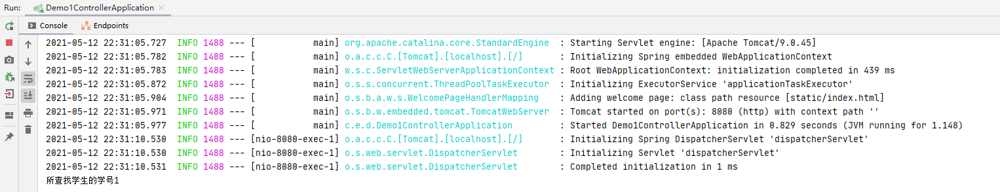

# SpringBoot

## 一、SpringBoot简介

### 1、什么是SpringBoot

SpringBoot用来简化spring应用开发，约定大于配置，去繁从简，是J2EE一站式解决方案

### 2、SpringBoot的优点

1. 快速创建独立运行的Spring项目以及主流框架的集成
2. 使用嵌入式的Servlet容器，应用无需打成WAR包
3. starts自动依赖与版本控制
4. 大量的自动配置，简化开发，也可修改默认值
5. 无需配置XML，无代码生成，开箱即用
6. 准生成环境的运行时应用监控
7. 与云计算天然集成

### 3、Spring Boot Flow体系结构


### 4、SpringBoot项目

#### 1.SpringBoot项目常见目录结构


#### 2.SpringBoot项目分层

**（1）Controller层：控制层**  

**Controller层负责具体的业务模块流程的控制**。Controller层负责前后端交互，接受前端请求，调用Service层，接收Service层返回的数据，最后返回具体的页面和数据到客户端。

**（2）Service层：业务层**

**Service层负责业务模块的逻辑应用设计。**先设计放接口的类，再创建实现的类，然后在配置文件中进行配置其实现的关联。Service层调用Dao层接口，接收Dao层返回的数据，完成项目的基本功能设计。封装Service层的业务逻辑有利于业务逻辑的独立性和重复利用性。

**（3）Dao层：数据访问层**

**Dao层负责与数据库进行交互。**Dao层封装对于数据库的增删改查，不涉及业务逻辑，只是达到按某个条件对数据库中的数据进行某一具体操作的要求。（有的项目中也将Dao层写为Mapper层）

**（4）Domain层：数据表对象层**

**Domain层定义数据库中存储的实体类。**（有的项目也将Domain层写为Entity层或Model层）

**（5）Config层：配置类层**

**Config层定义一些与配置有关的类。**

#### 3.工作流程


## 二、Controller层（demo1_controller项目）

### 1、新建项目

安装[IDEA](https://www.jetbrains.com/idea/download/#section=windows)：JAVA语言开发的集成环境

安装[JDK](https://www.oracle.com/java/technologies/javase-downloads.html)：JAVA开发工具包

安装[Maven](https://maven.apache.org/download.cgi):项目包管理工具，在pom.xml中写要使用的库，maven可自动下载

#### 1.项目建立过程

1. 点开**File-New-Project**，在左侧栏中找到**Spring Initializr**，在**Project SDK**栏中选择JDK版本（8），然后点击Next

   

2. 填完信息后，点击Next

   

   此处的组织名和项目名由自己命名，仅是一个项目标识符，没有特别的规则

3. 此界面可以选择需要的依赖于选择SpringBoot的版本。此时我们只需要用到spring Web依赖，点击Next。如果后续需求有所变化，可以在pom.xml文件进行修改

   

4. 检查当前页面，点击Finish,此时已经成功新建一个SpringBoot项目

   

#### 2.新建项目的目录结构


- /src/main/java/com/example/demo1_controller/**Demo1ControllerApplication**：启动类
- /src/main/resources目录下目录结构
  - **static**：保存所有的静态资源 js css images
  - **templates**：保存所有的模板页面(SpringBoot默认jar包使用嵌入式的Tomcat，默认不支持jsp页面，可以使用模板引擎freemarker、thyleaf)，由于现在倾向前后端开发的模式（后台springboot，前端采用vue，react等），因此模板引擎逐渐在被主流技术淘汰。
  - **application.properties**：SpringBoot应用配置文件，可以修改一些默认设置。（springboot支持properties和yaml两种格式的配置文件，只要文件名是application，springboot均可识别。）
- /src/test/java/com/example/demo1_controller/**Demo1ControllerApplicationTests**：测试类

------

项目使用的**JDK**版本可以在**File->Project Structure**文件夹下的内容进行修改

项目使用的**Maven**版本可以在**File->Settings->Build,Execution,Deployment->Build Toos->Maven**下修改

#### 3.部分文件内容

- pom.xml文件

查看目前pom.xml的依赖模块

```xml
<!-- web模块 -->
<dependency>
    <groupId>org.springframework.boot</groupId>
    <artifactId>spring-boot-starter-web</artifactId>
</dependency>
<!-- test模块 -->
<dependency>
    <groupId>org.springframework.boot</groupId>
    <artifactId>spring-boot-starter-test</artifactId>
    <scope>test</scope>
</dependency>
```

新增maven-compiler-plugin插件指定jdk版本（根据实际情况（就是有没有报错）看是否要加，有的人不加也没有问题）。

```xml
<build>
    <plugins>
        <plugin>
            <groupId>org.springframework.boot</groupId>
            <artifactId>spring-boot-maven-plugin</artifactId>
        </plugin>

        <!-- maven-compiler-plugin插件 指定项目源码及编译后的Jdk版本 -->
        <plugin>
            <groupId>org.apache.maven.plugins</groupId>
            <artifactId>maven-compiler-plugin</artifactId>
            <version>3.8.1</version>
            <configuration>
                <source>1.8</source>
                <target>1.8</target>
            </configuration>
        </plugin>
    </plugins>
</build>
```

- application.properties文件内容为空

### 2、Controller类

#### 1.新建Controller类

1. 在/src/main/java/com/example/demo1_controller目录下新建文件夹**controller**（右键**demo1_controller**文件夹-**>New**->**Package：controller**）

2. 在**controller**文件夹下新建类**StudentController**（右键**controller**文件夹->**New**->**Java Class：StudentController**）

3. 在**StudentController**类上添上注解**@Controller**，表明这是一个controller类（可以在里面定义一些路由函数）

   此时StudentController.java文件全部内容为

   ```java
   package com.example.demo1_controller.Controller;
   
   import org.springframework.stereotype.Controller;
   
   @Controller
   public class StudentController {
   }
   ```

#### 2.尝试后端给前端返回一个Hello World内容

在StudentController方法类写HelloWorld()方法

```java
@ResponseBody
@RequestMapping(value = "/helloworld")
public String HelloWorld() {
    return "Hello World";
}
```

------

**（1）@RequestMapping（"url"）**是处理请求地址映射，url是请求路径的一部分。（@RequestMapping表明这是一个路由函数）

此时前端请求路径为：http://localhost:8080/helloworld，项目运行结果


@RequestMapping("url")也可以用在controller类上，此时controller类中的方法的请求路径后部分内容为类的url拼接上方法的url

如在controller类上添加@RequestMapping("/student")

```java
@Controller
@RequestMapping(value = "/student")
public class StudentController {

    @ResponseBody
    @RequestMapping(value = "/helloworld")
    public String HelloWorld() {
        return "Hello World";
    }
}
```

此时前端请求路径为http://localhost:8080/student/helloworld，项目运行结果


------

**（2）@ResponseBody**注解的作用是将controller的方法返回的对象通过适当的转换器转换为指定的格式之后，写入到response对象的body区，通常用来返回**JSON**数据或者是XML数据

controller类的方法可以通过返回值进行页面跳转，如果采用@ResponseBody则使该方法直接返回数据给前端

@ResponseBody注解可以直接放在controller类上，则表示该类所有方法返回值都是给前端的数据

```
@Controller
@ResponseBody
@RequestMapping(value = "/student")
public class StudentController {

    @RequestMapping(value = "/helloworld")
    public String HelloWorld() {
        return "Hello World";
    }
}
```

此时项目运行结果与（1）相同

------

**（3）@RestController**相当于@ResponseBody ＋ @Controller合在一起的作用，是一种简洁写法。

```java
@RestController
@RequestMapping(value = "/student")
public class StudentController {

    @RequestMapping(value = "/helloworld")
    public String HelloWorld() {
        return "Hello World";
    }
}
```

此时项目运行结果与（1）相同

#### 3.初始页面

SpringBoot默认的页面映射路径（即模板文件存放的位置）为“classpath:/templates/*.html”。静态文件路径为“classpath:/static/”，其中可以存放JS、CSS等模板共用的静态文件

SpringBoot整合了springmvc的拦截功能，拦截了所有的请求。默认放行的资源是：**resources/static/ 目录下所有静态资源**。（不走controller控制器就能直接访问到资源）html页面如果放在resources/templates目录下，则需要走controller控制器，controller放行，允许该资源访问，该资源才能被访问到。否则就会报404错误

此时**resources/static**与 **resources/templates** 目录下都为空

我们在**resources/static**目录下新建HTML文件**index.html**，此时目录结构


index.html文件内容

```html
<!DOCTYPE html>
<html lang="en">
<head>
    <meta charset="UTF-8">
    <title>初始页面</title>
</head>
<body>
欢迎来到SpringBoot
</body>
</html>
```

项目运行访问初始页面


------

如果我们想更换初始页面，可以通过配置SpringMVC来实现（此处以thymeleaf模板引擎作为演示，知道thymeleaf的样子是什么即可，不用专门学，但实际使用static目录下的html文件也可以完成，配置类中的写法略作修改即可。）

1. **导入thymeleaf依赖**

   1. 在pom.xml文件<dependencies></dependencies>标签内新增thymeleaf模块

      ```xml
      <!-- thymeleaf模块 -->
      <dependency>
          <groupId>org.springframework.boot</groupId>
          <artifactId>spring-boot-starter-thymeleaf</artifactId>
      </dependency>
      ```

   2. 在pom.xml文件<properties></properties>标签内设置thymeleaf模块版本

      ```xml
      <!-- 设置thymeleaf模板引擎的模板 -->
      <thymeleaf.version>3.0.11.RELEASE</thymeleaf.version>
      <thymeleaf-layout-dialect.version>2.2.2</thymeleaf-layout-dialect.version>
      ```

2. **新建一个初始页面studentlist.html**

   1. 在resources/templates目录下新建文件夹**stduent**

   2. 在**student**文件夹下新建**studentlist.html**文件

      

3. **编写一个配置类**

   1. 在/src/main/java/com/example/demo1_controller目录下新建文件夹**config**
   2. 在**config**文件夹下新建类**MyMvcConfig**
   3. **MyMvcConfig**实现**WebMvcConfigurer**接口与使用@Configuration表明为配置类
   4. 添加视图控制器
   
   `! 注意实验室之前的项目主要采用的SSM框架，没有这个配置类，注意区分SSM和springboot的内容。`

```java
package com.example.demo1_controller.config;

import org.springframework.web.servlet.config.annotation.ViewControllerRegistry;
import org.springframework.web.servlet.config.annotation.WebMvcConfigurer;

@Configuration
public class MyMvcConfig implements WebMvcConfigurer {

    /**
     * 视图控制器
     * @param registry
     */
    @Override
    public void addViewControllers(ViewControllerRegistry registry) {
        //初始页面设置为"student/studentlist"
        //第一次参数为指定访问路径，第二个参数为指定访问视图名
        registry.addViewController("/").setViewName("student/studentlist");
    }
}
```

此时运行项目的初始页面为


**注意**：不可在MyMvcConfig上注解**@EnableWebMvc**，若注解@EnableWebMvc，表明全面接管SpringMVC配置。不使用@EnableWebMvc注解，仅表示在SpringBoot默认配置上对SpringMVC进行扩展

**更换初始页面也可以不使用thymeleaf模板，直接在resources/static文件夹下新建html文件，然后在配置类MyMvcConfig的视图控制器方法中增加访问路径与视图名的映射即可，实际项目中因为前后端分离，也不会使用thymeleaf模板进行开发**

------

#### 4.CRUD操作

##### **（1）请求路径**

**Restful风格**

|      | 普通CRUD                     | RestfulCRUD           |
| ---- | ---------------------------- | --------------------- |
| 查询 | getStudent                   | student---GET         |
| 添加 | addStudent?xxx               | student---POST        |
| 修改 | updateStudent?id=xxx&xxx=xxx | student/{id}---PUT    |
| 删除 | deleteStduent?id=1           | stduent/{id}---DELETE |

普通的CRUD用的是易于理解的请求路径，如getStudent（获取学生，GET请求）、addStudent（添加学生，GET请求）？xxx

RestFul风格的CRUD可以使用同名的请求路径，通过不同的请求方式来区分具体的请求：如查询与添加请求路径都是.../student，但GET方法是查询，POST方法是添加。将url视为资源，根据**HTTP请求方式（HTTP协议的内容）**对资源产生不同的操作GET是查询、POST是添加、PUT是更新、DELETE是删除。

**请求架构**

|                            | 请求uri      | 请求方式 |
| -------------------------- | ------------ | -------- |
| 查询所有学生               | students     | GET      |
| 查询某个学生(来到修改页面) | student/{id} | GET      |
| 来到添加页面               | student      | GET      |
| 添加学生                   | student      | POST     |
| 来到修改页面(查询某个学生) | student/{id} | GET      |
| 修改学生                   | student      | PUT      |
| 删除学生                   | student/{id} | DELETE   |

##### **（2）学生实体类**

1. 在/src/main/java/com/example/demo1_controller目录下新建文件夹**domain**

2. 在**domain**文件夹下新建类**Student**

3. 写好属性与方法

   ```jav
   package com.example.demo1_controller.domain;
   
   import org.springframework.format.annotation.DateTimeFormat;
   
   import java.io.Serializable;
   import java.util.Date;
   
   /**
    * Student类 学生实体类
    */
   public class Student implements Serializable {
   
       private Integer id;         //学号
       private String name;        //姓名
       private Integer score;      //成绩
       private String birthplace;  //籍贯
       //日期的格式 年-月-日
       @DateTimeFormat(pattern = "yyyy-MM-dd")
       private Date birthday;      //生日
   
       public Integer getId() {
           return id;
       }
   
       public void setId(Integer id) {
           this.id = id;
       }
   
       public String getName() {
           return name;
       }
   
       public void setName(String name) {
           this.name = name;
       }
   
       public Integer getScore() {
           return score;
       }
   
       public void setScore(Integer score) {
           this.score = score;
       }
   
       public String getBirthplace() {
           return birthplace;
       }
   
       public void setBirthplace(String birthplace) {
           this.birthplace = birthplace;
       }
   
       public Date getBirthday() {
           return birthday;
       }
   
       public void setBirthday(Date birthday) {
           this.birthday = birthday;
       }
   
       @Override
       public String toString() {
           return "Student{" +
                   "id=" + id +
                   ", name='" + name + '\'' +
                   ", score=" + score +
                   ", birthplace='" + birthplace + '\'' +
                   ", birthday=" + birthday +
                   '}';
       }
   }
   ```

##### （3）添加学生

①在studentlist.html页面新增添加按钮

```html
<!DOCTYPE html>
<html lang="en"xmlns:th="http://www.thymeleaf.org">
<head>
    <meta charset="UTF-8">
    <title>学生列表</title>
</head>
<body>
    <div>
        <a th:href="@{/student}">
            <button>添加学生</button>
        </a>
    </div>
</body>
</html>
```

<a></a>标签里的th:href就是请求路径

**注意：新建的html文件没有指定使用thymeleaf模板引擎，需要在<html></html>标签里添加xmlns:th="http://www.thymeleaf.org"**

**studentlist.html页面**


------

②编写controller类的ToStudent()方法

用户点击添加按钮，我们需要能够跳转到学生信息的添加页面，故将/student路径映射到一个可以跳转至学生信息添加页面的方法上

```java
package com.example.demo1_controller.controller;

import org.springframework.stereotype.Controller;
import org.springframework.web.bind.annotation.GetMapping;
import org.springframework.web.bind.annotation.RequestMapping;
import org.springframework.web.bind.annotation.ResponseBody;

@Controller
public class StudentController {

    @ResponseBody
    @RequestMapping(value = "/helloworld")
    public String HelloWorld() {
        return "Hello World";
    }

    /**
     * 来到学生信息页面
     * @return
     */
    @GetMapping(value = "/student")
    public String ToStudent() {

        return "student/studentinfo";
    }
}
```

因为需要用到页面跳转，所以该controller就不注解为@RestController，需要直接返回数据给前端的可以用@ResponseBody注解

**@GetMapping（"url"）相当于@RequestMapping(valus = "url",method = RequestMethod.GET)**也是一种简洁写法。

------

③新增studentinfo.html页面

在resources/templates/student文件夹下新建studentinfo.html文件,写一个表单输入需要添加的学生信息

```html
<!DOCTYPE html>
<html lang="en"xmlns:th="http://www.thymeleaf.org">
<head>
    <meta charset="UTF-8">
    <title>学生信息</title>
</head>
<body>
    <form th:action="@{/student}" method="post">
        <div>
            <label>学号</label>
            <input name="id">
        </div>
        <div>
            <label>姓名</label>
            <input name="name">
        </div>
        <div>
            <label>成绩</label>
            <input name="score">
        </div>
        <div>
            <label>籍贯</label>
            <input name="birthplace">
        </div>
        <div>
            <label>生日</label>
            <input name="birthday" type="date">
        </div>
        <button type="submit" th:text="添加"></button>
    </form>
</body>
</html>
```

<form></form>表单中th:action是请求路径，method为请求方式，此处为POST请求
**studentinfo.html页面**


------

④编写controller类的AddStudent()方法

```java
/**
* 添加学生信息
* @param student
* @return
*/
@PostMapping(value = "/student")
public String AddStudent(Student student) {

    //执行添加学生信息操作，本项目未连接数据库，仅在控制台输出需要存储的学生数据
    System.out.println(student);
    //跳转至学生列表页面
    return "student/studentlist";
}
```

**@PostMapping（"url"）相当于@RequestMapping(valus = "url",method = RequestMethod.POST)**

因为SpringBoot项目中有Student类，会把前端输入的数据自动封装到Student类中，使用Student类里的toString方法把数据输出到控制台。

------

⑤业务流程

1. 来到初始界面：学生列表页面（与①中页面一样）

2. 点击添加学生按钮来到学生信息页面，输入数据

   

3. 点击添加按钮回到学生列表页面（与①中页面一样），控制台可以看到前端写入的学生数据

   

##### （4）查找学生

①在studentlist.html页面新增学生学号输入框及查找按钮

```html
    <div>
        <form th:action="@{/student/{id}}" method="get">
            <input name="id">
            <button type="submit" th:text="查找"></button>
        </form>
    </div>
```

<form></form>此处请求路径为xxx/studnet/{id},请求方式为GET
------

②编写controller类的FindStudentById()方法

```java
/**
     * 查找某个学生信息
     * @param id
     * @return
     */
@GetMapping(value = "/student/{id}")
public String FindStudentById(Integer id) {

    //执行通过学生id从数据库查找学生信息操作，本项目未连接数据库，仅在控制台输出学生id
    System.out.println("所查找学生的学号"+id);
    //跳转至学生信息页面
    return "student/studentinfo";
}
```

------

③业务流程

1. 来到初始页面

   

2. 在输入框输入需要查询的学生学号

   

3. 点击查找按钮后来到学生信息页面，如果连接了数据库执行了查找操作后会在本页面显示该学生的信息

   
   
   控制台输出所查找的学生学号
   
   

因为添加学生和查找学生用的同一个学生信息页面，即studentinfo.html，添加学生跳转的学生信息页面下方按钮应该为“添加”，而查找学生跳转的学生信息页面下方按钮可以省略，或者下方变为两个按钮：修改与删除。可以采用判断是否有student值，如果为空则说明是添加学生跳转过来的页面，如果非空则说明是查找学生跳转过来的页面，具体方法在此不详谈。

##### （5）修改学生

需要修改学生则应当首先查找到学生，查找过程与**（4）查找学生**相同

此时查找成功后跳转至学生信息页面，下方有修改及删除按钮

由于本项目未连接数据库，无法判断学生信息页面是由添加学生按钮还是查找学生按钮跳转，所以不再实现功能

##### （6）删除学生

同**（5）修改学生**，此处不再实现

#### 5、常用注解

- ##### RequestMapping

  ```java
  public @interface RequestMapping {
      String name() default "";
  
      @AliasFor("path")
      String[] value() default {};
  
      @AliasFor("value")
      String[] path() default {};
  
      RequestMethod[] method() default {};
  
      String[] params() default {};
  
      String[] headers() default {};
  
      String[] consumes() default {};
  
      String[] produces() default {};
  }
  ```
  - **value**： 指定请求的实际地址，指定的地址可以是具体地址、可以RestFul动态获取、也可以使用正则设置
  - **method**： 指定请求的method类型， 分为GET、POST、PUT、DELETE等
  - consumes： 指定处理请求的提交内容类型（Content-Type），例如application/json, text/html
  - produces: 指定返回的内容类型，仅当request请求头中的(Accept)类型中包含该指定类型才返回
  - params： 指定request中必须包含某些参数值是，才让该方法处理
  - headers： 指定request中必须包含某些指定的header值，才能让该方法处理请求
  
  主要理解value及method，其余参数一般不用。

## 三、Service层（demo2_service项目）

### 1、新建项目

新建项目过程与demo1_controller项目类似，不再赘述

### 2、Servie层处理前端请求并返回数据

**1.环境准备**

pom.xml文件里也要添加thymeleaf模块，指定thymeleaf版本，以及新增maven-compiler-plugin插件指定jdk版本，具体方法demo1_controller已经展示过

**2.新建StudentController类**

在src/main/java/com/example/demo2_service目录下新建**controller文件夹**，并在controller文件夹下新建**StudentController类**,StudentController上注解@RestController

**3.新建Service接口及ServiceImpl类**

在src/main/java/com/example/demo2_service目录下新建**service文件夹**，在service文件夹下新建**StudentService接口**与**impl文件夹**，在impl文件夹下再新建**StudentServiceImpl类**并实现**StudentService接口**,在StudentServiceImpl类上用**@Service注解**表明这是一个Service类

**4.在Service接口及ServiceImpl类中声明及实现方法**

在StudentService接口中声明getFibonacciResult(Integer number)方法

```java
/**
  * 通过前端传入数据计算斐波那契数列值
  * @param number
  * @return
  */
public Integer getFibonacciResult(Integer number);
```

在StduentServiceImpl类中实现getFibonacciResult(Integer number)方法

```java
/**
  * 通过前端传入数据计算斐波那契数列值
  * @param number
  * @return
  */
@Override
public Integer getFibonacciResult(Integer number) {

    if (number == 1 || number == 2) {
        return 1;
    } else {
        return getFibonacciResult(number - 1) + getFibonacciResult(number - 2);
    }
}
```

**5.编写controller类**

使用@Autowired自动注入StudentService，并编写getFibonacciResult(Integer number)方法

```java
@Autowired
StudentService studentService;

/**
  * 前端输入初始值，返回斐波那契数列值
  * @param number
  * @return
  */
@RequestMapping("/getFibonacciResult")
public Integer getFibonacciResult(Integer number) {

    return studentService.getFibonacciResult(number);
}
```

通过@Autowired自动注入StudentService，就可以从controller层使用service层的类对象，并调用其方法，对象的创建、销毁等生命周期由SpringBoot管理，开发者不用考虑

**6.配置SpringMVC**

（此步骤非必要，一般是在springboot项目中，修改默认启动页（默认启动页是static/index.html），修改@ResponseBody返回json转换方式，新增资源过滤，配置跨域，添加拦截器等操作需要配置mvc。）

在src/main/java/com/example/demo2_service目录下新建**config文件夹**，并在config文件夹下新建**MyMvcConfig类**

MyMvcConfig类

```java
package com.example.demo2_service.config;

import org.springframework.context.annotation.Configuration;
import org.springframework.web.servlet.config.annotation.ViewControllerRegistry;
import org.springframework.web.servlet.config.annotation.WebMvcConfigurer;

@Configuration
public class MyMvcConfig implements WebMvcConfigurer {

    /**
     * 视图控制器
     * @param registry
     */
    @Override
    public void addViewControllers(ViewControllerRegistry registry) {
        //初始页面设置为"student"
        //第一次参数为指定访问路径，第二个参数为指定访问视图名
        registry.addViewController("/").setViewName("student");
    }
}
```

**7.新建并编写Student.html文件**

在resources/templates目录下新建Student.html文件，并编写一个input输入框与button按钮，用于前端向后端提交数据

```html
<!DOCTYPE html>
<html lang="en"xmlns:th="http://www.thymeleaf.org">
<head>
    <meta charset="UTF-8">
    <title>Title</title>
</head>
<body>
    <div>
        <form th:action="@{/getFibonacciResult}" method="post">
            <input name="number">
            <button type="submit" th:text="提交"></button>
        </form>
    </div>
</body>
</html>
```

**8.业务流程**

1. 来到初始页面student.html，在input输入框内输入数字10

   

2. 点击提交按钮，即可得到经过Service层计算得到的返回值

   

### 3、Service层将Dao层的数据传递给前端

一般dao层是用于读写数据库的层，此处使用代码中固定的数据来模拟数据库读写，章节四中会连接数据库，演示实际读写数据库的操作。

**1.新建StudentDao类**

在src/main/java/com/example/demo2_service目录下新建dao文件夹，并在dao文件夹下新建**StudentDao类**,StudentDao上注解@Repository表明这是一个Dao类

**注意：正常SpringBoot项目开发中，Dao层一般设置为接口而非具体类**

**2.编写StudentDao类**

```java
package com.example.demo2_service.dao;

import org.springframework.stereotype.Repository;

/**
 * 数据访问层
 */
@Repository
public class StudentDao {

    String studentDaoString = new String("from StudentDao");

    /**
     * 得到Dao层数据
     * @return
     */
    public String getStudentDaoString() {
        return studentDaoString;
    }
}
```

此处getStudentDaoString()方法为返回一个字符串

**3.编写StudentService接口与StudentServiceImpl类**

StduentService接口

```java
package com.example.demo2_service.service;

/**
 * 业务层
 */
public interface StudentService {

    /**
     * 通过前端传入数据计算斐波那契数列值
     * @param number
     * @return
     */
    public Integer getFibonacciResult(Integer number);

    /**
     * 得到Dao层数据
     * @return
     */
    public String getStudentDaoString();

}
```

StudentServiceImpl类

```java
package com.example.demo2_service.service.impl;

import com.example.demo2_service.dao.StudentDao;
import com.example.demo2_service.service.StudentService;
import org.springframework.beans.factory.annotation.Autowired;
import org.springframework.stereotype.Service;

/**
 * 业务层
 */
@Service
public class StudentServiceImpl implements StudentService {

    @Autowired
    StudentDao studentDao;

    /**
     * 通过前端传入数据计算斐波那契数列值
     * @param number
     * @return
     */
    @Override
    public Integer getFibonacciResult(Integer number) {

        if (number == 1 || number == 2) {
            return 1;
        } else {
            return getFibonacciResult(number - 1) + getFibonacciResult(number - 2);
        }
    }

    /**
     * 得到Dao层数据
     * @return
     */
    @Override
    public String getStudentDaoString() {
        return studentDao.getStudentDaoString();
    }
}
```

**4.编写StduentController类**

```java
package com.example.demo2_service.controller;

import com.example.demo2_service.service.StudentService;
import org.springframework.beans.factory.annotation.Autowired;
import org.springframework.web.bind.annotation.RequestMapping;
import org.springframework.web.bind.annotation.RestController;

/**
 * 控制层
 */
@RestController
public class StudentController {

    @Autowired
    StudentService studentService;

    /**
     * 前端输入初始值，返回斐波那契数列值
     * @param number
     * @return
     */
    @RequestMapping("/getFibonacciResult")
    public Integer getFibonacciResult(Integer number) {

        return studentService.getFibonacciResult(number);
    }

    /**
     * 通过Service层得到Dao层的数据
     * @return
     */
    @RequestMapping("/getStudentDaoString")
    public String getStudentDaoString() {
        return studentService.getStudentDaoString();
    }
}
```

**5.业务流程**

前端访问http://localhost:8080/getStudentDaoString地址


## 四、Dao层(demo3_dao项目)

### 1、新建项目

新建项目过程与demo1_controller项目类似，不再赘述

### 2、环境准备

需要安装

[MySQL](https://www.mysql.com/downloads/)（建议安装MySQL8版本）

[Navicat for MySQL](https://www.mysql.com/downloads/)

**1.pom.xml**

jdbc模块、druid模块、log4j2模块、mysql驱动模块、mybatis模块

```html
<!-- jdbc模块 spring读写数据库的库 -->
<dependency>
    <groupId>org.springframework.boot</groupId>
    <artifactId>spring-boot-starter-jdbc</artifactId>
</dependency>

<!-- druid模块 数据库连接池（池子里放一些连接，每次直接取，不用新建提升性能） -->
<dependency>
    <groupId>com.alibaba</groupId>
    <artifactId>druid</artifactId>
    <version>1.1.20</version>
</dependency>

<!-- log4j2模块 日志 -->
<dependency>
    <groupId>log4j</groupId>
    <artifactId>log4j</artifactId>
    <version>1.2.17</version>
</dependency>

<!-- mysql驱动模块 连接mysql的驱动 -->
<dependency>
    <groupId>mysql</groupId>
    <artifactId>mysql-connector-java</artifactId>
    <version>8.0.23</version>
</dependency>

<!-- mybatis模块 spring读写数据库的另一个库 -->
<dependency>
    <groupId>org.mybatis.spring.boot</groupId>
    <artifactId>mybatis-spring-boot-starter</artifactId>
    <version>2.1.4</version>
</dependency>
```

同样使用maven-compiler-plugin插件指定项目源码及编译后的Jdk版本

```xml
<!-- maven-compiler-plugin插件 指定项目源码及编译后的Jdk版本 -->
<plugin>
    <groupId>org.apache.maven.plugins</groupId>
    <artifactId>maven-compiler-plugin</artifactId>
    <version>3.8.1</version>
    <configuration>
        <source>1.8</source>
        <target>1.8</target>
    </configuration>
</plugin>
```

**2.application.yaml**

默认配置文件为application.properties，我们采用yaml格式的配置文件，在**resources文件夹下新建application.yaml文件**，原有的application.properties可以删除

```yaml
spring:
  datasource:
    #数据源基本配置
    username: root
    password: 123
    url: jdbc:mysql://localhost:3306/springboot?useUnicode=true&characterEncoding=utf8&serverTimezone=GMT%2B8
    driver-class-name: com.mysql.cj.jdbc.Driver
    type: com.alibaba.druid.pool.DruidDataSource
    initialization-mode: always
    schema:
      - classpath:sql/student.sql   #数据库建表语句
      
    #配置监控统计拦截的filters，去掉后监控界面sql无法统计，‘wall'用于防火墙
    filters: stat,wall,log4j
    #打开PSCache，并且指定每个连接上PSCache的大小
    maxPoolPreparedStatementPerConnectionSize: 20
    #合并多个DruidDataSource的监控数据
    useGlobalDataSourceStat: true
    connectionProperties:
      #druid.stat.mergeSql合并执行的相同sql，避免因为参数不同而统计多条sql语句
      #druid.stat.slowSqlMillis用来配置SQL慢的标准，执行时间超过slowSqlMillis的就是慢
      druid.stat.mergeSql = true;druid.stat.slowSqlMillis = 500

  #使form表单可以发送put请求
  mvc:
    hiddenmethod:
      filter:
        enabled: true

#mybatis配置
mybatis:
  #指定sql映射文件路径
  mapper-locations: classpath:mybatis/mapper/*.xml
```

配置文件此处不进行详细说明

**3.Druid配置类**

在src/main/java/com/example/demo3_dao目录下新建**config文件夹**，并在config文件夹下新建**DruidConfig类**。暂时不用研究此类，甚至直接不配置也行。

```java
package com.example.demo3_dao.config;

import com.alibaba.druid.pool.DruidDataSource;
import com.alibaba.druid.support.http.StatViewServlet;
import com.alibaba.druid.support.http.WebStatFilter;
import org.springframework.boot.context.properties.ConfigurationProperties;
import org.springframework.boot.web.servlet.FilterRegistrationBean;
import org.springframework.boot.web.servlet.ServletRegistrationBean;
import org.springframework.context.annotation.Bean;
import org.springframework.context.annotation.Configuration;

import javax.sql.DataSource;
import java.util.Arrays;
import java.util.HashMap;
import java.util.Map;

/**
 * Druid配置类
 */
@Configuration
public class DruidConfig {

    @Bean
    @ConfigurationProperties(prefix = "spring.datasource")
    public DataSource druid() {
        return new DruidDataSource();
    }

    /**
     * 配置Druid监控
     * @return
     */
    //配置一个管理后台的Servlet
    @Bean
    public ServletRegistrationBean statViewServlet() {

        ServletRegistrationBean bean = new ServletRegistrationBean(new StatViewServlet(),"/druid/*");

        Map<String,String> initParams = new HashMap<>();
        initParams.put("loginUsername","admin");
        initParams.put("loginPassword","123456");
        initParams.put("allow","");     //默认允许所有访问
        bean.setInitParameters(initParams);

        return bean;
    }

    //配置一个web监控的filter
    @Bean
    public FilterRegistrationBean webStatFilter() {
        FilterRegistrationBean bean = new FilterRegistrationBean();
        bean.setFilter(new WebStatFilter());

        Map<String,String> initParams = new HashMap<>();
        initParams.put("exclusions","*.js,*.css,/druid/*");
        bean.setInitParameters(initParams);

        bean.setUrlPatterns(Arrays.asList("/*"));

        return bean;
    }
}
```

**4.log4j日志**

在resources目录下新建log4j.properties文件。（也非必须，主要是配置日志打印到哪儿（控制台？文件？），以什么样的方式打印等）

```pro
log4j.rootLogger=DEBUG, stdout
log4j.appender.stdout=org.apache.log4j.ConsoleAppender
log4j.appender.stdout.layout=org.apache.log4j.PatternLayout
log4j.appender.stdout.layout.ConversionPattern=%5p [%t] - %m%n
```

**5.student.sql建表语句**

在resources目录下新建sql文件夹，将student.sql文件导入sql文件夹

```sql
SET NAMES utf8;
SET FOREIGN_KEY_CHECKS = 0;

-- ----------------------------
-- Table structure for student
-- ----------------------------
CREATE TABLE IF NOT EXISTS `student`  (
  `id` int NOT NULL COMMENT '学号',
  `name` varchar(16) CHARACTER SET utf8 COLLATE utf8_general_ci NOT NULL COMMENT '姓名',
  `score` int NOT NULL COMMENT '成绩',
  `birthplace` varchar(16) CHARACTER SET utf8 COLLATE utf8_general_ci NOT NULL COMMENT '籍贯',
  `birthday` date NOT NULL COMMENT '生日',
  PRIMARY KEY (`id`) USING BTREE
) ENGINE = InnoDB CHARACTER SET = utf8 COLLATE = utf8_general_ci ROW_FORMAT = Dynamic;

SET FOREIGN_KEY_CHECKS = 1;
```

**6.Student实体类**

在src/main/java/com/example/demo3_dao目录下新建**domain**文件夹，并在domain下新建**Student**类

### 3、连接数据库

此时可以在测试类中查看数据源

src/test/java/com/example/demo3_dao/Demo3DaoApplicationTests

```java
package com.example.demo3_dao;

import org.junit.jupiter.api.Test;
import org.springframework.beans.factory.annotation.Autowired;
import org.springframework.boot.test.context.SpringBootTest;

import javax.sql.DataSource;
import java.sql.Connection;
import java.sql.SQLException;

@SpringBootTest
class Demo3DaoApplicationTests {

    @Autowired
    DataSource dataSource;

    /**
     * 测试查看数据源
     * @throws SQLException
     */
    @Test
    void contextLoads() throws SQLException {
        System.out.println(dataSource.getClass());

        Connection connection = dataSource.getConnection();
        System.out.println("数据源："+connection);
        connection.close();
    }
}
```

运行测试类的contextLoads()方法，可在控制台看到druid数据源


运行程序，控制台可以发现数据库建表语句


通过Navicat可以发现springboot下已经成功新建数据表


### 4、注解法进行CRUD

StduentDao

```java
package com.example.demo3_dao.dao;

import com.example.demo3_dao.domain.Student;
import org.apache.ibatis.annotations.*;
import org.springframework.stereotype.Repository;

import java.util.List;

@Mapper
@Repository
public interface StudentDao {

    /**
     * 添加学生信息
     * @param student
     */
    @Insert("INSERT INTO student(id,name,score,birthplace,birthday) VALUES (#{id},#{name},#{score},#{birthplace},#{birthday})")
    public void AddStudent(Student student);

    /**
     * 删除学生信息
     * @param id
     */
    @Delete("DELETE FROM student WHERE id=#{id}")
    public void DeleteStudentById(Integer id);

    /**
     * 修改学生信息
     * @param student
     */
    @Update("UPDATE student SET name=#{name},score=#{score},birthplace=#{birthplace},birthday=#{birthday} WHERE id=#{id}")
    public void UpdateStudent(Student student);

    /**
     * 查找某个学生信息
     * @param id
     * @return
     */
    @Select("SELECT * FROM student WHERE id=#{id}")
    public Student FindStudentById(Integer id);

    /**
     * 查找所有学生信息
     * @return
     */
    @Select("SELECT * FROM student")
    public List<Student> FindAllStudent();
}
```

本项目未编写controller层、service层等，就不具体实现其功能，可以通过使用测试类（Demo3DaoApplicationTests）查看是否成功进行数据交互

**1.测试添加学生功能**

添加学生测试方法

```java
/**
  * 测试添加学生
  */
@Test
public void AddStudent() {

    //默认一个学生信息
    Student student = new Student();
    student.setId(1);
    student.setName("张三");
    student.setScore(100);
    student.setBirthplace("四川");
    SimpleDateFormat simpleDateFormat = new SimpleDateFormat("yyyy-MM-dd");
    Date date = new Date();
    try {
        date = simpleDateFormat.parse("2020-02-02");
    } catch (ParseException e) {
        e.printStackTrace();
    }
    student.setBirthday(date);

    //在控制台输出学生信息
    System.out.println("学生信息："+student);
    //将学生信息存入数据库
    studentDao.AddStudent(student);
}
```

运行测试方法

控制台可以看到学生信息


通过Navicat可以看到数据被写入数据库


**2.测试查找学生功能**

通过Navicat在数据库写入几条数据


查找学生测试方法

```java
/**
  * 测试查找学生
  * @return
  */
@Test
public void FindStudentById() {

    //从数据库查找学生
    Student student = studentDao.FindStudentById(2);
    //在控制台输出学生信息
    System.out.println("查找的学生信息："+student);
}
```

运行测试方法

可在控制台看到查找学生的信息


**3.测试修改学生功能**

修改学生测试方法

```java
/**
  * 测试修改学生
  */
@Test
public void UpdateStudent() {

    //默认一个学生信息
    Student student = new Student();
    //待修改学生的学号
    student.setId(1);
    //修改其他信息
    student.setName("张三");
    student.setScore(60);
    student.setBirthplace("新疆");
    SimpleDateFormat simpleDateFormat = new SimpleDateFormat("yyyy-MM-dd");
    Date date = new Date();
    try {
        date = simpleDateFormat.parse("2020-01-01");
    } catch (ParseException e) {
        e.printStackTrace();
    }
    student.setBirthday(date);

    //在控制台输出学生信息
    System.out.println("修改后的学生信息："+student);
    //修改学生信息
    studentDao.UpdateStudent(student);
}
```

运行测试方法

可在控制台看到修改后的学生的信息


通过Navicat可以看到数据库中的内容已经被修改


**4.测试删除学生功能**

删除学生测试方法

```java
/**
  * 测试删除学生   */
@Test
public void DeleteStudentById() {
    //删除学号为2的学生
    studentDao.DeleteStudentById(2);
}
```

运行测试方法

通过Navicat可以看到数据库中的内容已经被修改


### 5、配置文件法进行CRUD

**1.新建并编写StduentMapper.xml文件**

在resources目录下新建mybatis文件夹，在mybatis文件夹下新建mapper文件夹，在mapper文件夹下新建StudentMapper.xml

```xml
<?xml version="1.0" encoding="UTF-8" ?>
<!DOCTYPE mapper
        PUBLIC "-//mybatis.org//DTD Mapper 3.0//EN"
        "http://mybatis.org/dtd/mybatis-3-mapper.dtd">
<mapper namespace="com.example.demo3_dao.dao.StudentDao">

    <!-- 新增学生 -->
    <insert id="AddStudent">
        INSERT INTO student(id,name,score,birthplace,birthday) VALUES (#{id},#{name},#{score},#{birthplace},#{birthday})
    </insert>

    <!-- 删除学生 -->
    <delete id="DeleteStudentById">
        DELETE FROM student WHERE id=#{id}
    </delete>

    <!-- 更新学生 -->
    <update id="UpdateStudent">
        UPDATE student SET name=#{name},score=#{score},birthplace=#{birthplace},birthday=#{birthday} WHERE id=#{id}
    </update>

    <!-- 查询某个学生 -->
    <select id="FindStudentById" resultType="com.example.demo.domain.Student">
        SELECT * FROM student WHERE id=#{id}
    </select>

    <!-- 查询所有学生 -->
    <select id="FindAllStudent" resultType="com.example.demo.domain.Student">
        SELECT * FROM student
    </select>

</mapper>
```

**2.在application.yaml文件中配置mybatis信息**

```yaml
#mybatis配置
mybatis:
  #指定sql映射文件路径
  mapper-locations: classpath:mybatis/mapper/*.xml
```

**3.StudentDao.interface方法名与StduentMapper.xml中的id名要一一对应**

如StduentDao.interface中新增学生

```java
public void AddStudent(Student student);
```

StudentMapper.xml中新增学生

```xml
<!-- 新增学生 -->
<insert id="AddStudent">
    INSERT INTO student(id,name,score,birthplace,birthday) VALUES (#{id},#{name},#{score},#{birthplace},#{birthday})
</insert>
```

此时StudentDao.interfeace内容为

```java
package com.example.demo3_dao.dao;

import com.example.demo3_dao.domain.Student;
import org.apache.ibatis.annotations.*;
import org.springframework.stereotype.Repository;

import java.util.List;

@Mapper
@Repository
public interface StudentDao {

    /**
     * 添加学生信息
     * @param student
     */
    public void AddStudent(Student student);

    /**
     * 删除学生信息
     * @param id
     */
    public void DeleteStudentById(Integer id);

    /**
     * 修改学生信息
     * @param student
     */
    public void UpdateStudent(Student student);

    /**
     * 查找某个学生信息
     * @param id
     * @return
     */
    public Student FindStudentById(Integer id);

    /**
     * 查找所有学生信息
     * @return
     */
    public List<Student> FindAllStudent();
}
```

本项目未编写controller层、service层等，就不具体实现其功能

可以从测试类中验证CRUD操作，与注解法类似，此处不再演示。

----

二、三、四三个demo带你学习了controller、service、dao等，前端使用的thymeleaf模板引擎。

1. 你能不看代码，自己尝试复现一下自己的demo么？
2. 你能将前端改写成传统的HTML，js，而不适用模板引擎么？（请求数据采用ajax或fetch）
3. 你能使用vue cli改写前端么？

## 五、Demo项目（整合了前面全部功能的一个演示项目）

#### 1、目录结构

见 一、SpringBoot简介->4、SpringBoot项目->1.SpringBoot项目常见目录结构

#### 2、层级简介

**src/main/java/com/example/demo目录下**

config是配置文件夹

controller是控制层文件夹

dao是数据访问层文件夹

domain是数据表对象层文件夹

service是业务层文件夹

**src/main/resources文件夹下**

mybatis是mybatis相关文件夹

sql是Mysql语句文件夹

static是静态资源文件夹

templates是模板文件夹

**src/test目录下与测试相关**

**pom.xml与配置依赖相关**

#### 3、CRUD演示

##### 1.添加学生

初始页面


进入添加页面并填写信息


点击添加按钮回到学生列表页面


##### 2.查找学生

此项目仅做了查询所有学生信息，点击“查询所有学生信息”按钮即可在学生列表页面看到所有学生信息

##### 3.修改学生

点击需要修改的学生信息右侧的修改按钮，此处选择修改2号学生，进入修改页面


点击修改按钮返回至学生列表页面


##### 4.删除学生

点击需要删除的学生信息右侧的删除按钮，此处选择删除4号学生，刷新学生列表页面

