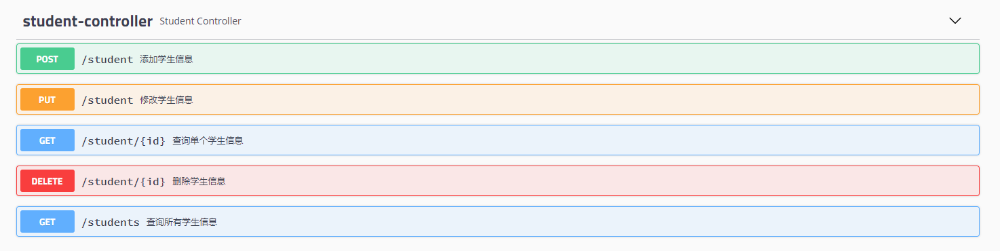

# Swagger

## 一、什么是swagger

Swagger 是一个规范和完整的框架，用于生成、描述、调用和可视化RESTful风格的 Web 服务。总体目标是使客户端和文件系统作为服务器以同样的速度来更新。文件的方法，参数和模型紧密集成到服务器端的代码，允许API来始终保持同步。Swagger让部署管理和使用功能强大的API变得非常简单。

## 二、配置swagger

### 1、pom.xml

```xml
<!-- swagger2模块 -->
<dependency>
    <groupId>io.springfox</groupId>
    <artifactId>springfox-swagger-ui</artifactId>
    <version>2.9.2</version>
</dependency>
<dependency>
    <groupId>io.springfox</groupId>
    <artifactId>springfox-swagger2</artifactId>
    <version>2.9.2</version>
</dependency>
```

### 2、Swagger2Config类

在src/main/java/com/example/demo/config目录下新建Swagger2Config类

```java
/**
 * Swagger2Configuration配置类
 */
@Configuration
@EnableSwagger2
public class Swagger2Config {
}
```

### 3、Docket方法

源码

```java
this.apiInfo = ApiInfo.DEFAULT;			//用于定义api文档汇总信息
this.groupName = "default";
this.enabled = true;
this.genericsNamingStrategy = new DefaultGenericTypeNamingStrategy();
this.applyDefaultResponseMessages = true;
this.host = "";
this.pathMapping = Optional.absent();
this.apiSelector = ApiSelector.DEFAULT;
this.enableUrlTemplating = false;
this.vendorExtensions = Lists.newArrayList();
this.documentationType = documentationType;
```

调用

```java
@Bean
public Docket createApi(){
    return new Docket(DocumentationType.SWAGGER_2)
        .apiInfo(apiInfo())
        //配置分组
        .groupName("user")
        //配置是否启动
        .enable(ture)
        .select()
        /**
        RequestHandlerSelectors：配置要扫描接口的方式
        basePackage：指定要扫描的包
        any()：扫描全部
        none()：不扫描
        withClassAnnotation：扫描类上的注解
        withMethodAnnotation：扫描方法上的注解
        **/
        .apis(RequestHandlerSelectors.basePackage("com.example.demo.controller"))
        //path()：过滤的路径
        //.path(PathSelectors.ant("/xxx/*"))
        .build();
}
```

### 4、ApiInfo方法

源码

```java
public static final Contact DEFAULT_CONTACT = new Contact("", "", "");
public static final ApiInfo DEFAULT;
private final String version;			//文档版本号
private final String title;				//文档页标题
private final String description;		//详细信息
private final String termsOfServiceUrl; //网站地址
private final String license;
private final String licenseUrl;
private final Contact contact;			//联系人信息
private final List<VendorExtension> vendorExtensions;
```

调用

```java
private ApiInfo apiInfo(){
    return new ApiInfoBuilder()
        .title("Swagger2")
        .description("RestFul API接口")
        .version("1.0")
        .build();
}
```

### 5、页面效果

http://localhost:8080/swagger-ui.html


groupName可以进行分组以区分后端开发者，如果有多个后端开发者，可以在Swagger2Config类里写多个Docket对象然后通过@Bean注入，不同的Docket对象代表不同的分组

```java
@Bean
public Docket createApi1(){
    return new Docket(DocumentationType.SWAGGER_2)
        .apiInfo(apiInfo())
        //配置分组
        .groupName("user1")		//user1分组
        //配置是否启动
        .enable(ture)
        .select()
        .apis(RequestHandlerSelectors.basePackage("com.example.demo.controller"))
        .build();
}

@Bean
public Docket createApi2(){
    return new Docket(DocumentationType.SWAGGER_2)
        .apiInfo(apiInfo())
        //配置分组
        .groupName("user2")		//user2分组
        //配置是否启动
        .enable(ture)
        .select()
        .apis(RequestHandlerSelectors.basePackage("com.example.demo.controller"))
        .build();
}
```

## 三、Swagger常用注解

### 1、@ApiModel

使用场景：在实体类上使用，标记类时swagger的解析类
概述：提供有关swagger模型的其它信息，类将在操作中用作类型时自动内省

```java
String value() default "";

String description() default "";

Class<?> parent() default Void.class;

String discriminator() default "";

Class<?>[] subTypes() default {};

String reference() default "";
```

| 属性名称      | 数据类型          | 默认值     | 说明                                                         |
| ------------- | ----------------- | ---------- | ------------------------------------------------------------ |
| value         | String            | 类名       | 为模型提供备用名称                                           |
| description   | String            | ""         | 提供详细的类描述                                             |
| parent        | Class<?> parent() | Void.class | 为模型提供父类以运行描述继承关系                             |
| discriminator | String            | ""         | 支持模型继承和多态，使用鉴别器的字段名称，可以断言需要使用哪个子类型 |
| subTypes      | Class<?>[]        | {}         | 从模型继承的子类型数组                                       |
| reference     | String            | ""         | 指定对应类型定义的引用，覆盖指定的任何其他元数据             |

示例

```java
/**
 * Student类 学生实体类
 */
@ApiModel(value = "Student",description = "用户实体类")
public class Student implements Serializable {
}
```

### 2、@ApiModelProperty

使用场景：使用在被 @ApiModel 注解的模型类的属性上。表示对model属性的说明或者数据操作更改 
概述：添加和操作模型属性的数据

```java
String value() default "";

String name() default "";

String allowableValues() default "";

String access() default "";

String notes() default "";

String dataType() default "";

boolean required() default false;

int position() default 0;

boolean hidden() default false;

String example() default "";

/** @deprecated */
@Deprecated
boolean readOnly() default false;

ApiModelProperty.AccessMode accessMode() default ApiModelProperty.AccessMode.AUTO;

String reference() default "";

boolean allowEmptyValue() default false;

Extension[] extensions() default {@Extension(
    properties = {@ExtensionProperty(
        name = "",
        value = ""
    )}
)};
```

| 属性名称        | 数据类型    | 默认值                                                       | 说明                                                         |
| --------------- | ----------- | ------------------------------------------------------------ | ------------------------------------------------------------ |
| value           | String      | ""                                                           | 属性简要说明                                                 |
| name            | String      | ""                                                           | 重写属性名称                                                 |
| allowableValues | String      | ""                                                           | 限制参数可接收的值，三种方法，固定取值，固定范围             |
| access          | String      | ""                                                           | 过滤属性                                                     |
| notes           | String      | ""                                                           | 目前尚未使用                                                 |
| dataType        | String      | ""                                                           | 参数的数据类型，可以是类名或原始数据类型，此值将覆盖从类属性读取的数据类型 |
| required        | boolean     | false                                                        | 是否为必传参数（false：非必传参数；true：必传参数）          |
| position        | int         | ""                                                           | 运行在模型中显示排序属性                                     |
| hidden          | boolean     | false                                                        | 隐藏模型属性（false：不隐藏；true：隐藏）                    |
| example         | String      | ""                                                           | 属性的示例值                                                 |
| readOnly        | boolean     | false                                                        | 指定模型属性为只读（false：非只读；true：只读）              |
| reference       | String      | ""                                                           | 指定对应类型定义的引用，覆盖指定的任何其他元数据             |
| allowEmptyValue | boolean     | false                                                        | 运行穿空值（false：不允许传空值；true：运行传空值）          |
| extensions      | Extension[] | {@Extension(properties={@ExtensionProperty(name = "",value = "")})}; | 关联注解                                                     |

示例

```java
@ApiModelProperty(value = "学号")
private Integer id;         //学号
@ApiModelProperty(value = "姓名")
private String name;        //姓名
@ApiModelProperty(value = "成绩")
private Integer score;      //成绩
@ApiModelProperty(value = "籍贯")
private String birthplace;  //籍贯
//日期的格式 年-月-日
@ApiModelProperty(value = "生日")
@DateTimeFormat(pattern = "yyyy-MM-dd")
private Date birthday;      //生日
```

### 3、@ApiOperation

使用场景：使用在方法上，表示一个http请求的操作

概述：用来表示Controller类下的http请求方法

```java
String value();

String notes() default "";

String[] tags() default {""};

Class<?> response() default Void.class;

String responseContainer() default "";

String responseReference() default "";

String httpMethod() default "";

/** @deprecated */
@Deprecated
int position() default 0;

String nickname() default "";

String produces() default "";

String consumes() default "";

String protocols() default "";

Authorization[] authorizations() default {@Authorization("")};

boolean hidden() default false;

ResponseHeader[] responseHeaders() default {@ResponseHeader(
    name = "",
    response = Void.class
)};

int code() default 200;

Extension[] extensions() default {@Extension(
    properties = {@ExtensionProperty(
        name = "",
        value = ""
    )}
)};

boolean ignoreJsonView() default false;
```

| 属性名称          | 数据类型            | 默认值                                                       | 说明                                                         |
| ----------------- | ------------------- | ------------------------------------------------------------ | ------------------------------------------------------------ |
| value             | String              |                                                              | 属性简要说明                                                 |
| notes             | String              | ""                                                           | 备注说明                                                     |
| tags              | String              | {""}                                                         | 可重新分组                                                   |
| response          | Class<?> response() | Void.class                                                   | 用于描述消息有效负载的可选响应类，对应于响应消息对象的 schema 字段 |
| responseContainer | String              | ""                                                           | 声明响应的容器，有效值为List,Set,Map，任何其他值都将被忽略   |
| responseReference | String              | ""                                                           | 声明响应的引用                                               |
| httpMethod        | String              | ""                                                           | http请求方式                                                 |
| position          | int                 | 0                                                            | 运行在模型中显示排序属性                                     |
| nickname          | String              | ""                                                           | 昵称                                                         |
| produces          | String              | ""                                                           | For example, "application/json, application/xml"             |
| consumes          | String              | ""                                                           | For example, "application/json, application/xml"             |
| protocols         | String              | ""                                                           | Possible values: http, https, ws, wss.                       |
| authorizations    | Authorization[]     | {@Authorization("")}                                         | 高级特性认证时配置                                           |
| hidden            | boolean             | false                                                        | 是否隐藏                                                     |
| responseHeaders   | ResponseHeader[]    | {@ResponseHeader(name = "",response = Void.class)};          | 可能响应的 header 列表                                       |
| code              | int                 | 200                                                          | http状态码                                                   |
| extensions        | Extension[]         | {@Extension(properties = {@ExtensionProperty(name = "",value = "")})}; | 关联注解                                                     |
| ignoreJsonView    | boolean             | false                                                        | 是否忽略json视图                                             |

示例

```java
@ApiOperation("添加学生信息")
@PostMapping(value = "/student")
public void AddStudent(Student student) {

    studentService.AddStudent(student);
}
```

### 4、@ApiParam

使用场景：在 Rest 接口上或 Rest 接口参数前边使用

概述：为 Rest 接口参数添加其它元数据(导入到 yapi 中不会被解析)

```java
String name() default "";

String value() default "";

String defaultValue() default "";

String allowableValues() default "";

boolean required() default false;

String access() default "";

boolean allowMultiple() default false;

boolean hidden() default false;

String example() default "";

Example examples() default @Example({@ExampleProperty(
    mediaType = "",
    value = ""
)});

String type() default "";

String format() default "";

boolean allowEmptyValue() default false;

boolean readOnly() default false;

String collectionFormat() default "";
```

| 属性名称         | 数据类型 | 默认值                                                   | 说明                                                         |
| ---------------- | -------- | -------------------------------------------------------- | ------------------------------------------------------------ |
| name             | String   | ""                                                       | 参数名称，参数名称将从 filed/method/parameter 名称中派生，但你可以覆盖它，路径参数必须始终命名为它们所代表的路径部分 |
| value            | String   | ""                                                       | 参数简单描述                                                 |
| defaultValue     | String   | ""                                                       | 描述参数默认值                                               |
| allowableValues  | String   | ""                                                       | 可接收参数值限制，有三种方式,取值列表，取值范围              |
| required         | boolean  | false                                                    | 是否为必传参数（false:非必传; true:必传）                    |
| access           | String   | ""                                                       | 参数过滤                                                     |
| allowMultiple    | boolean  | false                                                    | 指定参数是否可以通过多次出现来接收多个值                     |
| hidden           | boolean  | false                                                    | 隐藏参数列表中的参数                                         |
| example          | String   | ""                                                       | 非请求体(body)类型的单个参数示例                             |
| examples         | Example  | @Example({@ExampleProperty(mediaType = "",value = "")}); | 参数示例，仅适用于请求体类型的请求                           |
| type             | String   | ""                                                       | 添加覆盖检测到类型的功能                                     |
| format           | String   | ""                                                       | 添加提供自定义format格式的功能                               |
| allowEmptyValue  | boolean  | false                                                    | 添加将格式设置为空的功能                                     |
| readOnly         | boolean  | false                                                    | 添加被指定为只读的能力                                       |
| collectionFormat | String   | ""                                                       | 添加使用 array 类型覆盖 collectionFormat 的功能              |

示例

```java
@ApiOperation("判断验证码是否正确")
@RequestMapping(value = "/UpdatePassword" , method = RequestMethod.POST)
public CommonResult updatePassword(
    @ApiParam(value = "手机号码"，required = true) @RequestParam String userPhone,
    @ApiParam(value = "验证码",required = true) @RequestParam String authCode){

    return userMemberService.updatePassword(userPhone,authCode);
}
```

### 5、页面效果

1.@ApiModel与@ApiModelProperty效果


2.@ApiOperation效果



## 四、导出swagger接口文档

### 1、导入模块依赖

pom.xml文件

```xml
<!-- swagger2markup模块 -->
<dependency>
    <groupId>io.github.swagger2markup</groupId>
    <artifactId>swagger2markup</artifactId>
    <version>1.3.1</version>
</dependency>
```

### 2、新增测试类

在src/test/java/com/example/demo目录下新建测试类SwaggerTo

SwaggerTo

```java
@RunWith(SpringRunner.class) //测试类要使用注入的类
@SpringBootTest(webEnvironment = SpringBootTest.WebEnvironment.DEFINED_PORT) //用于单元测试
public class SwaggerTo {
}
```

### 3、新增测试方法

generateMarkdownDocs()

```java
/**
  * 生成Markdown格式文档
  * @throws Exception
  */
@Test
public void generateMarkdownDocs() throws Exception {
    //    输出Markdown格式
    Swagger2MarkupConfig config = new Swagger2MarkupConfigBuilder()
        .withMarkupLanguage(MarkupLanguage.MARKDOWN)    //输出格式：ASCIIDOC，MARKDOWN，CONFLUENCE_MARKUP
        .withOutputLanguage(Language.ZH)                //语言类型：中文（ZH） 默认英文（EN）
        .withPathsGroupedBy(GroupBy.TAGS)               //Api排序规则
        .withGeneratedExamples()
        .withoutInlineSchema()
        .build();

    Swagger2MarkupConverter.from(new URL("http://localhost:8080/v2/api-docs?group=user"))  //url，注意端口号与分组
        .withConfig(config)
        .build()
        .toFolder(Paths.get("src/docs/markdown/generated"));                //生成文件的存放路径，生成多个文件
}
```

此时在src/docs/markdown/generated目录下就会生成definitions.md、overview.md、paths.md、security.md文件，即生成的markdown文件


generateMarkdownDocsToFile()

```java
/**
 * 生成Markdown格式文档,并汇总成一个文件
 * @throws Exception
 */
@Test
public void generateMarkdownDocsToFile() throws Exception {
    //    输出Markdown到单文件
    Swagger2MarkupConfig config = new Swagger2MarkupConfigBuilder()
        .withMarkupLanguage(MarkupLanguage.MARKDOWN)	//输出格式：ASCIIDOC，MARKDOWN，CONFLUENCE_MARKUP
        .withOutputLanguage(Language.ZH)				//语言类型：中文（ZH） 默认英文（EN）
        .withPathsGroupedBy(GroupBy.TAGS)				//Api排序规则
        .withGeneratedExamples()
        .withoutInlineSchema()
        .build();

    Swagger2MarkupConverter.from(new URL("http://localhost:8080/v2/api-docs?group=user"))    //url，注意端口号与分组
        .withConfig(config)
        .build()
        .toFile(Paths.get("src/docs/markdown/generated/all"));                 //生成文件的存放路径，汇总为一个文件
}
```

此时在src/docs/markdown/generated目录下就会生成all.md文件，即生成的markdown文件


**注意：**

- 如果在Swagger2Config类里声明了分组，即Docket方法有**.groupName("user")**，那么测试方法中url路径后面需要添加**?group=user**。如果Swagger2Config类中未声明分组，则测试方法中url路径不需要添加**?group=user**
- 在使用测试方法生成文件的时候**需要关闭项目**，否则会提示**端口被占用**
- 可以修改Swagger2MarkupConfig.withMarkupLanguage()方法内的参数值来**生成不同的文件格式**，修改Swagger2MarkupConverter.toFile()方法内的参数值**提供对应的生成文件存放路径**
- **definitions.md**存放Models相关信息，**overview.md**存放文档概览相关信息，**paths.md**存放controller相关信息，**security.md**存放与身份认证相关的信息

### 4、导出文档部分内容

all.md

